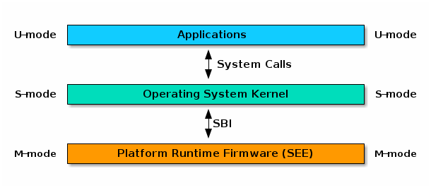
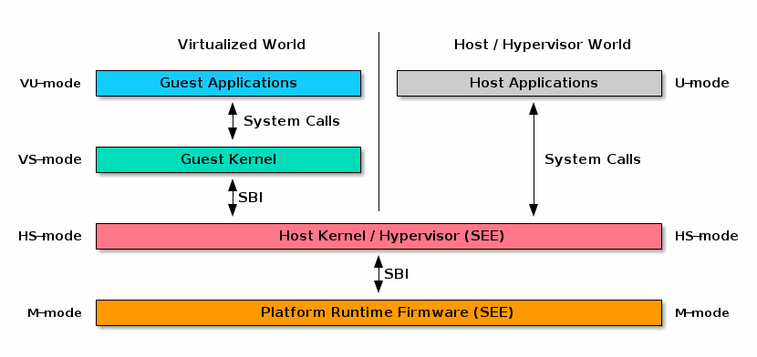
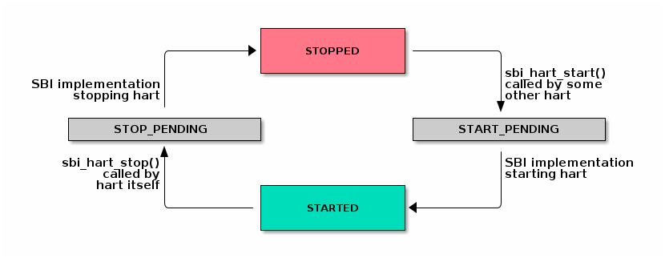

// SPDX-License-Identifier: CC-BY-4.0
[[riscv-doc-template]]
:description: RISC-V SBI definition specification
:company: RISC-V
// Pull in variable with revision info
include::autogenerated/revision.adoc-snippet[]
:revremark: Draft
:url-riscv: http://riscv.org
:doctype: book
:preface-title: Preamble
:colophon:
:appendix-caption: Appendix
:title-logo-image: image:docs-resources/images/risc-v_logo.svg[pdfwidth=3.25in,align=center]
// Settings:
:experimental:
:reproducible:
:WaveDromEditorApp: wavedrom-cli
:icons: font
:lang: en
:listing-caption: Listing
:sectnums:
:sectnumlevels: 5
:toclevels: 5
:toc: left
:source-highlighter: pygments
ifdef::backend-pdf[]
:source-highlighter: coderay
endif::[]
:data-uri:
:hide-uri-scheme:
:stem: latexmath
:footnote:
:xrefstyle: short

= RISC-V Supervisor Binary Interface Specification
:author: RISC-V Platform Runtime Services Task Group
:email: tech-prs@lists.riscv.org

// Preamble
[WARNING]
.This document is in the link:http://riscv.org/spec-state[Development state]
====
Assume everything can change but backward compatibility with perviously
ratified specification will be maintained.
====

// table of contents
toc::[]

[preface]
== Copyright and license information

This RISC-V SBI specification is (C) 2022 RISC-V International.

It is licensed under the Creative Commons Attribution 4.0 International
License (CC-BY 4.0). The full license text is available at
https://creativecommons.org/licenses/by/4.0/.

[preface]
== Change Log

=== Version 2.0-rc1

* Added common description for shared memory physical address range parameter
* Added SBI debug console extension
* Relaxed the counter width requirement on SBI PMU firmware counters
* Added sbi_pmu_counter_fw_read_hi() in SBI PMU extension
* Reserved space for SBI implementation specific firmware events
* Added SBI system suspend extension
* Added SBI CPPC extension
* Clarified that an SBI extension can be partially implemented only if it
  defines a mechanism to discover implemented SBI functions
* Added error code SBI_ERR_NO_SHMEM
* Added SBI nested acceleration extension
* Added common description for a virtual HART
* Added SBI steal-time accounting extension
* Added SBI PMU snapshot extension

=== Version 1.0.0

* Updated the version for ratification

=== Version 1.0-rc3

* Updated the calling convention
* Fixed a typo in PMU extension
* Added a abbreviation table

=== Version 1.0-rc2

* Update to RISC-V formatting
* Improved the introduction
* Removed all references to RV32

=== Version 1.0-rc1

* A typo fix

=== Version 0.3.0

* Few typo fixes
* Updated the LICENSE with detailed text instead of a hyperlink

=== Version 0.3-rc1

* Improved document styling and naming conventions
* Added SBI system reset extension
* Improved SBI introduction section
* Improved documentation of SBI hart state management extension
* Added suspend function to SBI hart state management extension
* Added performance monitoring unit extension
* Clarified that an SBI extension shall not be partially implemented

=== Version 0.2

* The entire v0.1 SBI has been moved to the legacy extension, which is now
  an optional extension. This is technically a backwards-incompatible change
  because the legacy extension is optional and v0.1 of the SBI doesn't allow
  probing, but it's as good as we can do.

== Introduction

This specification describes the RISC-V Supervisor Binary Interface, known
from here on as SBI. The SBI allows supervisor-mode (S-mode or VS-mode)
software to be portable across all RISC-V implementations by defining an
abstraction for platform (or hypervisor) specific functionality. The design
of the SBI follows the general RISC-V philosophy of having a small core along
with a set of optional modular extensions.

An SBI extension defines a set of SBI functions which provides a particular
functionality to supervisor-mode software. SBI extensions as a whole are
optional and cannot be partially implemented unless an SBI extension defines
a mechanism to discover implemented SBI functions. If sbi_probe_extension()
signals that an extension is available, all functions present in the SBI
version reported by sbi_get_spec_version() must conform to that version of
the SBI specification.

The higher privilege software providing SBI interface to the supervisor-mode
software is referred as an SBI implementation or Supervisor Execution
Environment (SEE). An SBI implementation (or SEE) can be platform runtime
firmware executing in machine-mode (M-mode) (see below <<fig_intro1>>) or
it can be some hypervisor executing in hypervisor-mode (HS-mode) (see below
<<fig_intro2>>).

[#fig_intro1]
.RISC-V System without H-extension

[#fig_intro2]
.RISC-V System with H-extension

HARTs are provisioned by the SBI implementation for supervisor-mode software.
Hence, from the perspective of the SBI implementation, the S-mode HART contexts
are referred to as virtual HARTs. In the case that the implementation is a
hypervisor, virtual HARTs represent the VS-mode guest contexts.

The SBI specification doesn’t specify any method for hardware discovery.
The supervisor software must rely on the other industry standard hardware
discovery methods (i.e. Device Tree or ACPI) for that.

== Terms and Abbreviations

This specification uses the following terms and abbreviations:

[width=80%]
|===
| Term  | Meaning

| ACPI  | Advanced Configuration and Power Interface
| ASID  | Address Space Identifier
| BMC   | Baseboard Management Controller
| CPPC  | Collaborative Processor Performance Control
| EID   | Extension ID
| FID   | Function ID
| HSM   | Hart State Management
| IPI   | Inter Processor Interrupt
| PMU   | Performance Monitoring Unit
| SBI   | Supervisor Binary Interface
| SEE   | Supervisor Execution Environment
| VMID  | Virtual Machine Identifier
|===

== Binary Encoding

All SBI functions share a single binary encoding, which facilitates the mixing
of SBI extensions. The SBI specification follows the below calling convention.

* An `ECALL` is used as the control transfer instruction between the supervisor
  and the SEE.

* `a7` encodes the SBI extension ID (*EID*),

* `a6` encodes the SBI function ID (*FID*) for a given extension ID encoded
   in `a7` for any SBI extension defined in or after SBI v0.2.

* All registers except `a0` & `a1` must be preserved across an SBI call by the
  callee.

* SBI functions must return a pair of values in `a0` and `a1`, with `a0`
returning an error code. This is analogous to returning the C structure

[source, C]
----
    struct sbiret {
        long error;
        long value;
    };
----

In the name of compatibility, SBI extension IDs (*EIDs*) and SBI function IDs
(*FIDs*) are encoded as signed 32-bit integers. When passed in registers these
follow the standard above calling convention rules.

The <<table_standard_sbi_errors>> below provides a list of Standard SBI
error codes.

[#table_standard_sbi_errors]
.Standard SBI Errors
[cols="4,1,4", width=90%, align="center", options="header"]
|===
|  Error Type                | Value | Description
|  SBI_SUCCESS               |  0    | Completed successfully
|  SBI_ERR_FAILED            | -1    | Failed
|  SBI_ERR_NOT_SUPPORTED     | -2    | Not supported
|  SBI_ERR_INVALID_PARAM     | -3    | Invalid parameter(s)
|  SBI_ERR_DENIED            | -4    | Denied or not allowed
|  SBI_ERR_INVALID_ADDRESS   | -5    | Invalid address(s)
|  SBI_ERR_ALREADY_AVAILABLE | -6    | Already available
|  SBI_ERR_ALREADY_STARTED   | -7    | Already started
|  SBI_ERR_ALREADY_STOPPED   | -8    | Already stopped
|  SBI_ERR_NO_SHMEM          | -9    | Shared memory not available
|===

An `ECALL` with an unsupported SBI extension ID (*EID*) or an unsupported SBI
function ID (*FID*) must return the error code `SBI_ERR_NOT_SUPPORTED`.

Every SBI function should prefer `unsigned long` as the data type. It keeps
the specification simple and easily adaptable for all RISC-V ISA types.
In case the data is defined as 32bit wide, higher privilege software must
ensure that it only uses 32 bit data only.

=== HART list parameter

If an SBI function needs to pass a list of harts to the higher privilege mode,
it must use a hart mask as defined below. This is applicable to any extensions
defined in or after v0.2.

Any function, requiring a hart mask, need to pass following two arguments.

* `unsigned long hart_mask` is a scalar bit-vector containing hartids
* `unsigned long hart_mask_base` is the starting hartid from which bit-vector
   must be computed.

In a single SBI function call, maximum number harts that can be set is
always XLEN. If a lower privilege mode needs to pass information about more
than XLEN harts, it should invoke multiple instances of the SBI function
call. `hart_mask_base` can be set to `-1` to indicate that `hart_mask` can
be ignored and all available harts must be considered.

Any function using hart mask may return error values listed in the
<<table_hart_mask_errors>> below which are in addition to function
specific error values.

[#table_hart_mask_errors]
.HART Mask Errors
[cols="1,2", width=90%, align="center", options="header"]
|===
| Error code            | Description
| SBI_ERR_INVALID_PARAM | Either `hart_mask_base`, or at least one hartid from
                          `hart_mask`, is not valid, i.e. either the hartid is
                          not enabled by the platform or is not available to
                          the supervisor.
|===

=== Shared memory physical address range parameter

If an SBI function needs to pass a shared memory physical address range to
the SBI implementation (or higher privilege mode), then this physical memory
address range MUST satisfy the following requirements:

* The SBI implementation MUST check that the supervisor-mode software is
  allowed to access the specified physical memory range with the access
  type requested (read and/or write).
* The SBI implementation MUST access the specified physical memory range
  using the PMA attributes.

NOTE: If the supervisor-mode software accesses the same physical memory
  range using a memory type different than the PMA, then a loss of coherence
  or unexpected memory ordering may occur.  The invoking software should
  follow the rules and sequences defined in the RISC-V Svpbmt specification
  to prevent the loss of coherence and memory ordering.

* The data in the shared memory MUST follow little-endian byte ordering.

It is recommended that a memory physical address passed to an SBI function
should use at least two `unsigned long` parameters to support platforms
which have memory physical addresses wider than XLEN bits.

== Base Extension (EID #0x10)

The base extension is designed to be as small as possible. As such, it only
contains functionality for probing which SBI extensions are available and for
querying the version of the SBI. All functions in the base extension must be
supported by all SBI implementations, so there are no error returns defined.

=== Function: Get SBI specification version (FID #0)

[source, C]
----
struct sbiret sbi_get_spec_version(void);
----

Returns the current SBI specification version. This function must always
succeed. The minor number of the SBI specification is encoded in the low 24
bits, with the major number encoded in the next 7 bits. Bit 31 must be 0 and
is reserved for future expansion.

=== Function: Get SBI implementation ID (FID #1)

[source, C]
----
struct sbiret sbi_get_impl_id(void);
----

Returns the current SBI implementation ID, which is different for every SBI
implementation. It is intended that this implementation ID allows software to
probe for SBI implementation quirks.

=== Function: Get SBI implementation version (FID #2)

[source, C]
----
struct sbiret sbi_get_impl_version(void);
----

Returns the current SBI implementation version. The encoding of this version
number is specific to the SBI implementation.

=== Function: Probe SBI extension (FID #3)

[source, C]
----
struct sbiret sbi_probe_extension(long extension_id);
----

Returns 0 if the given SBI extension ID (EID) is not available, or 1 if it is
available unless defined as any other non-zero value by the implementation.

=== Function: Get machine vendor ID (FID #4)

[source, C]
----
struct sbiret sbi_get_mvendorid(void);
----

Return a value that is legal for the `mvendorid` CSR and 0 is always a legal
value for this CSR.

=== Function: Get machine architecture ID (FID #5)

[source, C]
----
struct sbiret sbi_get_marchid(void);
----

Return a value that is legal for the `marchid` CSR and 0 is always a legal
value for this CSR.

=== Function: Get machine implementation ID (FID #6)

[source, C]
----
struct sbiret sbi_get_mimpid(void);
----

Return a value that is legal for the `mimpid` CSR and 0 is always a legal
value for this CSR.

=== Function Listing

[#table_base_function_list]
.Base Function List
[cols="3,2,1,1", width=70%, align="center", options="header"]
|===
| Function Name            | SBI Version | FID | EID
| sbi_get_sbi_spec_version | 0.2         |   0 | 0x10
| sbi_get_sbi_impl_id      | 0.2         |   1 | 0x10
| sbi_get_sbi_impl_version | 0.2         |   2 | 0x10
| sbi_probe_extension      | 0.2         |   3 | 0x10
| sbi_get_mvendorid        | 0.2         |   4 | 0x10
| sbi_get_marchid          | 0.2         |   5 | 0x10
| sbi_get_mimpid           | 0.2         |   6 | 0x10
|===

=== SBI Implementation IDs

[#table_sbi_implementation_ids]
.SBI Implementation IDs
[cols="1,2", width=70%, align="center", options="header"]
|===
| Implementation ID | Name
| 0                 | Berkeley Boot Loader (BBL)
| 1                 | OpenSBI
| 2                 | Xvisor
| 3                 | KVM
| 4                 | RustSBI
| 5                 | Diosix
| 6                 | Coffer
| 7                 | Xen Project
| 8                 | PolarFire Hart Software Services
|===

== Legacy Extensions (EIDs #0x00 - #0x0F)

The legacy SBI extensions follow a slightly different calling convention
as compared to the SBI v0.2 (or higher) specification where:

* The SBI function ID field in `a6` register is ignored because these are
  encoded as multiple SBI extension IDs.
* Nothing is returned in `a1` register.
* All registers except `a0` must be preserved across an SBI call by the
  callee.
* The value returned in `a0` register is SBI legacy extension specific.

The page and access faults taken by the SBI implementation while accessing
memory on behalf of the supervisor are redirected back to the supervisor
with `sepc` CSR pointing to the faulting `ECALL` instruction.

The legacy SBI extensions is deprecated in favor of the other extensions
listed below. The legacy console SBI functions (`sbi_console_getchar()`
and `sbi_console_putchar()`) are expected to be deprecated; they have
no replacement.

=== Extension: Set Timer (EID #0x00)

[source, C]
----
long sbi_set_timer(uint64_t stime_value)
----

Programs the clock for next event after *stime_value* time. This function
also clears the pending timer interrupt bit.

If the supervisor wishes to clear the timer interrupt without scheduling
the next timer event, it can either request a timer interrupt infinitely
far into the future (i.e., (uint64_t)-1), or it can instead mask the timer
interrupt by clearing `sie.STIE` CSR bit.

This SBI call returns 0 upon success or an implementation specific negative
error code.

=== Extension: Console Putchar (EID #0x01)

[source, C]
----
long sbi_console_putchar(int ch)
----

Write data present in *ch* to debug console.

Unlike `sbi_console_getchar()`, this SBI call **will block** if there remain
any pending characters to be transmitted or if the receiving terminal is not
yet ready to receive the byte. However, if the console doesn't exist at all,
then the character is thrown away.

This SBI call returns 0 upon success or an implementation specific negative
error code.

=== Extension: Console Getchar (EID #0x02)

[source, C]
----
long sbi_console_getchar(void)
----

Read a byte from debug console.

The SBI call returns the byte on success, or -1 for failure.

=== Extension: Clear IPI (EID #0x03)

[source, C]
----
long sbi_clear_ipi(void)
----

Clears the pending IPIs if any. The IPI is cleared only in the hart for
which this SBI call is invoked. `sbi_clear_ipi()` is deprecated because
S-mode code can clear `sip.SSIP` CSR bit directly.

This SBI call returns 0 if no IPI had been pending, or an implementation
specific positive value if an IPI had been pending.

=== Extension: Send IPI (EID #0x04)

[source, C]
----
long sbi_send_ipi(const unsigned long *hart_mask)
----

Send an inter-processor interrupt to all the harts defined in hart_mask.
Interprocessor interrupts manifest at the receiving harts as Supervisor
Software Interrupts.

hart_mask is a virtual address that points to a bit-vector of harts. The
bit vector is represented as a sequence of unsigned longs whose length
equals the number of harts in the system divided by the number of bits
in an unsigned long, rounded up to the next integer.

This SBI call returns 0 upon success or an implementation specific negative
error code.

=== Extension: Remote FENCE.I (EID #0x05)

[source, C]
----
long sbi_remote_fence_i(const unsigned long *hart_mask)
----

Instructs remote harts to execute `FENCE.I` instruction. The `hart_mask`
is same as described in `sbi_send_ipi()`.

This SBI call returns 0 upon success or an implementation specific negative
error code.

=== Extension: Remote SFENCE.VMA (EID #0x06)

[source, C]
----
long sbi_remote_sfence_vma(const unsigned long *hart_mask,
                           unsigned long start,
                           unsigned long size)
----

Instructs the remote harts to execute one or more `SFENCE.VMA` instructions,
covering the range of virtual addresses between start and size.

This SBI call returns 0 upon success or an implementation specific negative
error code.

=== Extension: Remote SFENCE.VMA with ASID (EID #0x07)

[source, C]
----
long sbi_remote_sfence_vma_asid(const unsigned long *hart_mask,
                                unsigned long start,
                                unsigned long size,
                                unsigned long asid)
----

Instruct the remote harts to execute one or more `SFENCE.VMA` instructions,
covering the range of virtual addresses between start and size. This covers
only the given `ASID`.

This SBI call returns 0 upon success or an implementation specific negative
error code.

=== Extension: System Shutdown (EID #0x08)

[source, C]
----
void sbi_shutdown(void)
----

Puts all the harts to shutdown state from supervisor point of view.

This SBI call doesn't return irrespective whether it succeeds or fails.

=== Function Listing

[cols="3,1,1,2", width=80%, align="center", options="header"]

[#table_legacy_function_list]
.Legacy Function List
[cols="4,2,1,2,3", width=100%, align="center", options="header"]
|===
| Function Name             | SBI Version | FID | EID       | Replacement EID
| sbi_set_timer             | 0.1         |   0 | 0x00      | 0x54494D45
| sbi_console_putchar       | 0.1         |   0 | 0x01      | N/A
| sbi_console_getchar       | 0.1         |   0 | 0x02      | N/A
| sbi_clear_ipi             | 0.1         |   0 | 0x03      | N/A
| sbi_send_ipi              | 0.1         |   0 | 0x04      | 0x735049
| sbi_remote_fence_i        | 0.1         |   0 | 0x05      | 0x52464E43
| sbi_remote_sfence_vma     | 0.1         |   0 | 0x06      | 0x52464E43
| sbi_remote_sfence_vma_asid| 0.1         |   0 | 0x07      | 0x52464E43
| sbi_shutdown              | 0.1         |   0 | 0x08      | 0x53525354
| *RESERVED*                |             |     | 0x09-0x0F |
|===

== Timer Extension (EID #0x54494D45 "TIME")

This replaces legacy timer extension (EID #0x00). It follows the new calling
convention defined in v0.2.

=== Function: Set Timer (FID #0)

[source, C]
----
struct sbiret sbi_set_timer(uint64_t stime_value)
----

Programs the clock for next event after *stime_value* time. *stime_value*
is in absolute time. This function must clear the pending timer interrupt
bit as well.

If the supervisor wishes to clear the timer interrupt without scheduling
the next timer event, it can either request a timer interrupt infinitely
far into the future (i.e., (uint64_t)-1), or it can instead mask the timer
interrupt by clearing `sie.STIE` CSR bit.

=== Function Listing

[#table_time_function_list]
.TIME Function List
[cols="4,2,1,2", width=80%, align="center", options="header"]
|===
| Function Name | SBI Version | FID | EID
| sbi_set_timer | 0.2         | 0   | 0x54494D45
|===

== IPI Extension (EID #0x735049 "sPI: s-mode IPI")

This extension replaces the legacy extension (EID #0x04). The other IPI related
legacy extension(0x3) is deprecated now. All the functions in this extension
follow the `hart_mask` as defined in the binary encoding section.

=== Function: Send IPI (FID #0)

[source, C]
----
struct sbiret sbi_send_ipi(unsigned long hart_mask,
                           unsigned long hart_mask_base)
----

Send an inter-processor interrupt to all the harts defined in hart_mask.
Interprocessor interrupts manifest at the receiving harts as the supervisor
software interrupts.

The possible error codes returned in `sbiret.error` are shown in the
<<table_ipi_send_errors>> below.

[#table_ipi_send_errors]
.IPI Send Errors
[cols="2,3", width=90%, align="center", options="header"]
|===
| Error code  | Description
| SBI_SUCCESS | IPI was sent to all the targeted harts successfully.
|===

=== Function Listing

[#table_ipi_function_list]
.IPI Function List
[cols="4,2,1,2", width=80%, align="center", options="header"]
|===
| Function Name | SBI Version | FID | EID
| sbi_send_ipi  | 0.2         | 0   | 0x735049
|===

== RFENCE Extension (EID #0x52464E43 "RFNC")

This extension defines all remote fence related functions and replaces
the legacy extensions (EIDs #0x05 - #0x07). All the functions follow the
`hart_mask` as defined in binary encoding section. Any function wishes
to use range of addresses (i.e. start_addr and size), have to abide by
the below constraints on range parameters.

The remote fence function acts as a full TLB flush if

* `start_addr` and `size` are both 0
* `size` is equal to 2^XLEN-1

=== Function: Remote FENCE.I (FID #0)

[source, C]
----
struct sbiret sbi_remote_fence_i(unsigned long hart_mask,
                                 unsigned long hart_mask_base)
----
Instructs remote harts to execute `FENCE.I` instruction.

The possible error codes returned in `sbiret.error` are shown in the
<<table_rfence_remote_fence_i_errors>> below.

[#table_rfence_remote_fence_i_errors]
.RFENCE Remote FENCE.I Errors
[cols="2,3", width=90%, align="center", options="header"]
|===
| Error code  | Description
| SBI_SUCCESS | IPI was sent to all the targeted harts successfully.
|===

=== Function: Remote SFENCE.VMA (FID #1)

[source, C]
----
struct sbiret sbi_remote_sfence_vma(unsigned long hart_mask,
                                    unsigned long hart_mask_base,
                                    unsigned long start_addr,
                                    unsigned long size)
----

Instructs the remote harts to execute one or more `SFENCE.VMA` instructions,
covering the range of virtual addresses between start and size.

The possible error codes returned in `sbiret.error` are shown in the
<<table_rfence_remote_sfence_vma_errors>> below.

[#table_rfence_remote_sfence_vma_errors]
.RFENCE Remote SFENCE.VMA Errors
[cols="2,3", width=90%, align="center", options="header"]
|===
| Error code              | Description
| SBI_SUCCESS             | IPI was sent to all the targeted harts
                            successfully.
| SBI_ERR_INVALID_ADDRESS | `start_addr` or `size` is not valid.
|===

=== Function: Remote SFENCE.VMA with ASID (FID #2)

[source, C]
----
struct sbiret sbi_remote_sfence_vma_asid(unsigned long hart_mask,
                                         unsigned long hart_mask_base,
                                         unsigned long start_addr,
                                         unsigned long size,
                                         unsigned long asid)
----

Instruct the remote harts to execute one or more `SFENCE.VMA` instructions,
covering the range of virtual addresses between start and size. This covers
only the given `ASID`.

The possible error codes returned in `sbiret.error` are shown in the
<<table_rfence_remote_sfence_vma_asid_errors>> below.

[#table_rfence_remote_sfence_vma_asid_errors]
.RFENCE Remote SFENCE.VMA with ASID Errors
[cols="2,3", width=90%, align="center", options="header"]
|===
| Error code              | Description
| SBI_SUCCESS             | IPI was sent to all the targeted harts
                            successfully.
| SBI_ERR_INVALID_ADDRESS | `start_addr` or `size` is not valid.
|===

=== Function: Remote HFENCE.GVMA with VMID (FID #3)

[source, C]
----
struct sbiret sbi_remote_hfence_gvma_vmid(unsigned long hart_mask,
                                          unsigned long hart_mask_base,
                                          unsigned long start_addr,
                                          unsigned long size,
                                          unsigned long vmid)
----

Instruct the remote harts to execute one or more `HFENCE.GVMA` instructions,
covering the range of guest physical addresses between start and size only
for the given `VMID`. This function call is only valid for harts implementing
hypervisor extension.

The possible error codes returned in `sbiret.error` are shown in the
<<table_rfence_remote_hfence_gvma_vmid_errors>> below.

[#table_rfence_remote_hfence_gvma_vmid_errors]
.RFENCE Remote HFENCE.GVMA with VMID Errors
[cols="2,3", width=90%, align="center", options="header"]
|===
| Error code              | Description
| SBI_SUCCESS             | IPI was sent to all the targeted harts
                            successfully.
| SBI_ERR_NOT_SUPPORTED   | This function is not supported as it is not
                            implemented or one of the target hart doesn't
                            support hypervisor extension.
| SBI_ERR_INVALID_ADDRESS | `start_addr` or `size` is not valid.
|===

=== Function: Remote HFENCE.GVMA (FID #4)

[source, C]
----
struct sbiret sbi_remote_hfence_gvma(unsigned long hart_mask,
                                     unsigned long hart_mask_base,
                                     unsigned long start_addr,
                                     unsigned long size)
----

Instruct the remote harts to execute one or more `HFENCE.GVMA` instructions,
covering the range of guest physical addresses between start and size for all
the guests. This function call is only valid for harts implementing hypervisor
extension.

The possible error codes returned in `sbiret.error` are shown in the
<<table_rfence_remote_hfence_gvma_errors>> below.

[#table_rfence_remote_hfence_gvma_errors]
.RFENCE Remote HFENCE.GVMA Errors
[cols="2,3", width=90%, align="center", options="header"]
|===
| Error code              | Description
| SBI_SUCCESS             | IPI was sent to all the targeted harts
                            successfully.
| SBI_ERR_NOT_SUPPORTED   | This function is not supported as it is not
                            implemented or one of the target hart doesn't
                            support hypervisor extension.
| SBI_ERR_INVALID_ADDRESS | `start_addr` or `size` is not valid.
|===

=== Function: Remote HFENCE.VVMA with ASID (FID #5)

[source, C]
----
struct sbiret sbi_remote_hfence_vvma_asid(unsigned long hart_mask,
                                          unsigned long hart_mask_base,
                                          unsigned long start_addr,
                                          unsigned long size,
                                          unsigned long asid)
----

Instruct the remote harts to execute one or more `HFENCE.VVMA` instructions,
covering the range of guest virtual addresses between start and size for the
given `ASID` and current `VMID` (in `hgatp` CSR) of calling hart. This function
call is only valid for harts implementing hypervisor extension.

The possible error codes returned in `sbiret.error` are shown in the
<<table_rfence_remote_hfence_vvma_asid_errors>> below.

[#table_rfence_remote_hfence_vvma_asid_errors]
.RFENCE Remote HFENCE.VVMA with ASID Errors
[cols="2,3", width=90%, align="center", options="header"]
|===
| Error code              | Description
| SBI_SUCCESS             | IPI was sent to all the targeted harts
                            successfully.
| SBI_ERR_NOT_SUPPORTED   | This function is not supported as it is not
                            implemented or one of the target hart doesn't
                            support hypervisor extension.
| SBI_ERR_INVALID_ADDRESS | `start_addr` or `size` is not valid.
|===

=== Function: Remote HFENCE.VVMA (FID #6)

[source, C]
----
struct sbiret sbi_remote_hfence_vvma(unsigned long hart_mask,
                                     unsigned long hart_mask_base,
                                     unsigned long start_addr,
                                     unsigned long size)
----

Instruct the remote harts to execute one or more `HFENCE.VVMA` instructions,
covering the range of guest virtual addresses between start and size for
current `VMID` (in `hgatp` CSR) of calling hart. This function call is only
valid for harts implementing hypervisor extension.

The possible error codes returned in `sbiret.error` are shown in the
<<table_rfence_remote_hfence_vvma_errors>> below.

[#table_rfence_remote_hfence_vvma_errors]
.RFENCE Remote HFENCE.VVMA Errors
[cols="2,3", width=90%, align="center", options="header"]
|===
| Error code              | Description
| SBI_SUCCESS             | IPI was sent to all the targeted harts
                            successfully.
| SBI_ERR_NOT_SUPPORTED   | This function is not supported as it is not
                            implemented or one of the target hart doesn't
                            support hypervisor extension.
| SBI_ERR_INVALID_ADDRESS | `start_addr` or `size` is not valid.
|===

=== Function Listing

[#table_rfence_function_list]
.RFENCE Function List
[cols="4,2,1,2", width=80%, align="center", options="header"]
|===
| Function Name               | SBI Version | FID | EID
| sbi_remote_fence_i          | 0.2         | 0   | 0x52464E43
| sbi_remote_sfence_vma       | 0.2         | 1   | 0x52464E43
| sbi_remote_sfence_vma_asid  | 0.2         | 2   | 0x52464E43
| sbi_remote_hfence_gvma_vmid | 0.2         | 3   | 0x52464E43
| sbi_remote_hfence_gvma      | 0.2         | 4   | 0x52464E43
| sbi_remote_hfence_vvma_asid | 0.2         | 5   | 0x52464E43
| sbi_remote_hfence_vvma      | 0.2         | 6   | 0x52464E43
|===

== Hart State Management Extension (EID #0x48534D "HSM")

The Hart State Management (HSM) Extension introduces a set of hart states and a
set of functions which allow the supervisor-mode software to request a hart
state change.

The <<table_hsm_states>> shown below describes all possible **HSM states**
along with a unique **HSM state id** for each state:

[#table_hsm_states]
.HSM Hart States
[cols="1,2,4", width=100%, align="center", options="header"]
|===
| State ID | State Name      | Description
| 0        | STARTED         | The hart is physically powered-up and executing
                               normally.
| 1        | STOPPED         | The hart is not executing in supervisor-mode
                               or any lower privilege mode. It is probably
                               powered-down by the SBI implementation if the
                               underlying platform has a mechanism to
                               physically power-down harts.
| 2        | START_PENDING   | Some other hart has requested to start (or
                               power-up) the hart from the **STOPPED** state
                               and the SBI implementation is still working to
                               get the hart in the **STARTED** state.
| 3        | STOP_PENDING    | The hart has requested to stop (or power-down)
                               itself from the **STARTED** state and the SBI
                               implementation is still working to get the hart
                               in the **STOPPED** state.
| 4        | SUSPENDED       | This hart is in a platform specific suspend
                               (or low power) state.
| 5        | SUSPEND_PENDING | The hart has requested to put itself in a
                               platform specific low power state from the
                               **STARTED** state and the SBI implementation
                               is still working to get the hart in the
                               platform specific **SUSPENDED** state.
| 6        | RESUME_PENDING  | An interrupt or platform specific hardware
                               event has caused the hart to resume normal
                               execution from the **SUSPENDED** state and
                               the SBI implementation is still working to
                               get the hart in the **STARTED** state.
|===

At any point in time, a hart should be in one of the above mentioned hart
states. The hart state transitions by the SBI implementation should follow
the state machine shown below in the <<figure_hsm>>.

[#figure_hsm]
.SBI HSM State Machine

A platform can have multiple harts grouped into hierarchical topology
groups (namely cores, clusters, nodes, etc.) with separate platform specific
low-power states for each hierarchical group. These platform specific
low-power states of hierarchical topology groups can be represented as
platform specific suspend states of a hart. An SBI implementation can
utilize the suspend states of higher topology groups using one of the
following approaches:

. *Platform-coordinated:* In this approach, when a hart becomes idle the
  supervisor-mode power-managment software will request deepest suspend
  state for the hart and higher topology groups. An SBI implementation
  should choose a suspend state at higher topology group which is:
.. Not deeper than the specified suspend state
.. Wake-up latency is not higher than the wake-up latency of the
   specified suspend state
. *OS-inititated:* In this approach, the supervisor-mode power-managment
  software will directly request a suspend state for higher topology group
  after the last hart in that group becomes idle. When a hart becomes idle,
  the supervisor-mode power-managment software will always select suspend
  state for the hart itself but it will select a suspend state for a higher
  topology group only if the hart is the last running hart in the group.
  An SBI implementation should:
.. Never choose a suspend state for higher topology group different from
   the specified suspend state
.. Always prefer most recent suspend state requested for higher topology
   group

=== Function: HART start (FID #0)

[source, C]
----
struct sbiret sbi_hart_start(unsigned long hartid,
                             unsigned long start_addr,
                             unsigned long opaque)
----

Request the SBI implementation to start executing the target hart in
supervisor-mode, at the address specified by `start_addr`, with the
specific register values described in <<table_hsm_hart_start_regs>>.

[#table_hsm_hart_start_regs]
.HSM Hart Start Register State
[cols=",", width=80%, align="center", options="header"]
|===
|Register Name | Register Value
|satp          | 0
|sstatus.SIE   | 0
|a0            | hartid
|a1            | `opaque` parameter
2+|All other registers remain in an undefined state.
|===

NOTE: A single `unsigned long` parameter is sufficient as `start_addr`,
because the hart will start execution in supervisor-mode with the MMU off,
hence `start_addr` must be less than XLEN bits wide.

This call is asynchronous -- more specifically, the `sbi_hart_start()` may
return before the target hart starts executing as long as the SBI implementation
is capable of ensuring the return code is accurate.
If the SBI implementation is a platform runtime firmware executing in
machine-mode (M-mode), then it MUST configure any physical memory protection
it supports, such as that defined by PMP, and other M-mode state, before
transferring control to supervisor-mode software.

The `hartid` parameter specifies the target hart which is to be started.

The `start_addr` parameter points to a runtime-specified physical address,
where the hart can start executing in supervisor-mode.

The `opaque` parameter is an XLEN-bit value which will be set in the `a1`
register when the hart starts executing at `start_addr`.

The possible error codes returned in `sbiret.error` are shown in the
<<table_hsm_hart_start_errors>> below.

[#table_hsm_hart_start_errors]
.HSM Hart Start Errors
[cols="1,2", width=100%, align="center", options="header"]
|===
| Error code                | Description
| SBI_SUCCESS               | Hart was previously in stopped state. It will
                              start executing from `start_addr`.
| SBI_ERR_INVALID_ADDRESS   | `start_addr` is not valid, possibly due to the
                              following reasons: +
                              * It is not a valid physical address. +
                              * Executable access to the address is prohibited
                                by a physical memory protection mechanism or
                                H-extension G-stage for supervisor-mode.
| SBI_ERR_INVALID_PARAM     | `hartid` is not a valid hartid as the
                              corresponding hart cannot be started in supervisor
                              mode.
| SBI_ERR_ALREADY_AVAILABLE | The given hartid is already started.
| SBI_ERR_FAILED            | The start request failed for unspecified or
                              unknown other reasons.
|===

=== Function: HART stop (FID #1)

[source, C]
----
struct sbiret sbi_hart_stop(void)
----

Request the SBI implementation to stop executing the calling hart in
supervisor-mode and return its ownership to the SBI implementation.
This call is not expected to return under normal conditions. The
`sbi_hart_stop()` must be called with supervisor-mode interrupts disabled.

The possible error codes returned in `sbiret.error` are shown in the
<<table_hsm_hart_stop_errors>> below.

[#table_hsm_hart_stop_errors]
.HSM Hart Stop Errors
[cols="1,2", width=100%, align="center", options="header"]
|===
| Error code     | Description
| SBI_ERR_FAILED | Failed to stop execution of the current hart
|===

=== Function: HART get status (FID #2)

[source, C]
----
struct sbiret sbi_hart_get_status(unsigned long hartid)
----

Get the current status (or HSM state id) of the given hart in `sbiret.value`,
or an error through `sbiret.error`.

The `hartid` parameter specifies the target hart for which status is
required.

The possible status (or HSM state id) values returned in `sbiret.value`
are described in <<table_hsm_states>>.

The possible error codes returned in `sbiret.error` are shown in the
<<table_hsm_hart_get_status_errors>> below.

[#table_hsm_hart_get_status_errors]
.HSM Hart Get Status Errors
[cols="1,2", width=100%, align="center", options="header"]
|===
| Error code            | Description
| SBI_ERR_INVALID_PARAM | The given `hartid` is not valid.
|===

The harts may transition HSM states at any time due to any concurrent
`sbi_hart_start()` or `sbi_hart_stop()` or `sbi_hart_suspend()` calls,
the return value from this function may not represent the actual state
of the hart at the time of return value verification.

=== Function: HART suspend (FID #3)

[source, C]
----
struct sbiret sbi_hart_suspend(uint32_t suspend_type,
                               unsigned long resume_addr,
                               unsigned long opaque)
----

Request the SBI implementation to put the calling hart in a platform specific
suspend (or low power) state specified by the `suspend_type` parameter. The
hart will automatically come out of suspended state and resume normal
execution when it receives an interrupt or platform specific hardware event.

The platform specific suspend states for a hart can be either retentive
or non-retentive in nature. A retentive suspend state will preserve hart
register and CSR values for all privilege modes whereas a non-retentive
suspend state will not preserve hart register and CSR values.

Resuming from a retentive suspend state is straight forward and the
supervisor-mode software will see SBI suspend call return without any
failures.  The `resume_addr` parameter is unused during retentive suspend.

Resuming from a non-retentive suspend state is relatively more involved and
requires software to restore various hart registers and CSRs for all privilege
modes. Upon resuming from non-retentive suspend state, the hart will jump to
supervisor-mode at address specified by `resume_addr` with specific registers
values described in the <<table_hsm_hart_resume_regs>> below.

[#table_hsm_hart_resume_regs]
.HSM Hart Resume Register State
[cols=",", width=80%, align="center", options="header"]
|===
|Register Name | Register Value
|satp          | 0
|sstatus.SIE   | 0
|a0            | hartid
|a1            | `opaque` parameter
2+|All other registers remain in an undefined state.
|===

NOTE: A single `unsigned long` parameter is sufficient for `resume_addr`,
because the hart will resume execution in supervisor-mode with the MMU off,
hence `resume_addr` must be less than XLEN bits wide.

The `suspend_type` parameter is 32 bits wide and the possible values are
shown in <<table_hsm_hart_suspend_types>> below.

[#table_hsm_hart_suspend_types]
.HSM Hart Suspend Types
[cols="1,2", width=90%, align="center", options="header"]
|===
| Value                   | Description
| 0x00000000              | Default retentive suspend
| 0x00000001 - 0x0FFFFFFF | Reserved for future use
| 0x10000000 - 0x7FFFFFFF | Platform specific retentive suspend
| 0x80000000              | Default non-retentive suspend
| 0x80000001 - 0x8FFFFFFF | Reserved for future use
| 0x90000000 - 0xFFFFFFFF | Platform specific non-retentive suspend
| > 0xFFFFFFFF            | Reserved
|===

The `resume_addr` parameter points to a runtime-specified physical address,
where the hart can resume execution in supervisor-mode after a non-retentive
suspend.

The `opaque` parameter is an XLEN-bit value which will be set in the `a1`
register when the hart resumes execution at `resume_addr` after a
non-retentive suspend.

The possible error codes returned in `sbiret.error` are shown in the
<<table_hsm_hart_suspend_errors>> below.

[#table_hsm_hart_suspend_errors]
.HSM Hart Suspend Errors
[cols="1,2", width=100%, align="center", options="header"]
|===
| Error code              | Description
| SBI_SUCCESS             | Hart has suspended and resumed successfully
                            from a retentive suspend state.
| SBI_ERR_INVALID_PARAM   | `suspend_type` is reserved or is platform-specific
                            and unimplemented.
| SBI_ERR_NOT_SUPPORTED   | `suspend_type` is not reserved and is implemented,
                            but the platform does not support it due to one
                            or more missing dependencies.
| SBI_ERR_INVALID_ADDRESS | `resume_addr` is not valid, possibly due to the
                            following reasons: +
                            * It is not a valid physical address. +
                            * Executable access to the address is prohibited
                              by a physical memory protection mechanism or
                              H-extension G-stage for supervisor-mode.
| SBI_ERR_FAILED          | The suspend request failed for unspecified or
                            unknown other reasons.
|===

=== Function Listing

[#table_hsm_function_list]
.HSM Function List
[cols="3,2,1,2", width=80%, align="center", options="header"]
|===
| Function Name       | SBI Version | FID | EID
| sbi_hart_start      | 0.2         |  0  | 0x48534D
| sbi_hart_stop       | 0.2         |  1  | 0x48534D
| sbi_hart_get_status | 0.2         |  2  | 0x48534D
| sbi_hart_suspend    | 0.3         |  3  | 0x48534D
|===

== System Reset Extension (EID #0x53525354 "SRST")

The System Reset Extension provides a function that allow the supervisor
software to request system-level reboot or shutdown. The term "system"
refers to the world-view of supervisor software and the underlying SBI
implementation could be provided by machine mode firmware or a hypervisor.

=== Function: System reset (FID #0)

[source, C]
----
struct sbiret sbi_system_reset(uint32_t reset_type, uint32_t reset_reason)
----

Reset the system based on provided `reset_type` and `reset_reason`. This is
a synchronous call and does not return if it succeeds.

The `reset_type` parameter is 32 bits wide and it's possible values are shown
in the <<table_srst_system_reset_types>> below.

[#table_srst_system_reset_types]
.SRST System Reset Types
[cols="1,2", width=90%, align="center", options="header"]
|===
| Value                   | Description
| 0x00000000              | Shutdown
| 0x00000001              | Cold reboot
| 0x00000002              | Warm reboot
| 0x00000003 - 0xEFFFFFFF | Reserved for future use
| 0xF0000000 - 0xFFFFFFFF | Vendor or platform specific reset type
| > 0xFFFFFFFF            | Reserved
|===

The `reset_reason` is an optional parameter representing the reason for
system reset. This parameter is 32 bits wide with possible values shown
in the <<table_srst_system_reset_reasons>> below

[#table_srst_system_reset_reasons]
.SRST System Reset Reasons
[cols="1,2", width=90%, align="center", options="header"]
|===
| Value                   | Description
| 0x00000000              | No reason
| 0x00000001              | System failure
| 0x00000002 - 0xDFFFFFFF | Reserved for future use
| 0xE0000000 - 0xEFFFFFFF | SBI implementation specific reset reason
| 0xF0000000 - 0xFFFFFFFF | Vendor or platform specific reset reason
| > 0xFFFFFFFF            | Reserved
|===

When supervisor software is running natively, the SBI implementation is
provided by machine mode firmware. In this case, shutdown is equivalent to
a physical power down of the entire system and cold reboot is equivalent to
a physical power cycle of the entire system. Further, warm reboot is equivalent
to a power cycle of the main processor and parts of the system, but not the
entire system. For example, on a server class system with a BMC (board
management controller), a warm reboot will not power cycle the BMC whereas a
cold reboot will definitely power cycle the BMC.

When supervisor software is running inside a virtual machine, the SBI
implementation is provided by a hypervisor. Shutdown, cold reboot and warm
reboot will behave functionally the same as the native case, but might not
result in any physical power changes.

The possible error codes returned in `sbiret.error` are shown in the
<<table_srst_system_reset_errors>> below.

[#table_srst_system_reset_errors]
.SRST System Reset Errors
[cols="1,2", width=100%, align="center", options="header"]
|===
| Error code            | Description
| SBI_ERR_INVALID_PARAM | At least one of `reset_type` or `reset_reason` is
                          reserved or is platform-specific and unimplemented.
| SBI_ERR_NOT_SUPPORTED | `reset_type` is not reserved and is implemented,
                          but the platform does not support it due to one
                          or more missing dependencies.
| SBI_ERR_FAILED        | The reset request failed for unspecified or
                          unknown other reasons.
|===

=== Function Listing

[#table_srst_function_list]
.SRST Function List
[cols="3,2,1,2", width=80%, align="center", options="header"]
|===
| Function Name       | SBI Version | FID | EID
| sbi_system_reset    | 0.3         |   0 | 0x53525354
|===

== Performance Monitoring Unit Extension (EID #0x504D55 "PMU")

The RISC-V hardware performance counters such as `mcycle`, `minstret`, and
`mhpmcounterX` CSRs are accessible as read-only from supervisor-mode using
`cycle`, `instret`, and `hpmcounterX` CSRs. The SBI performance monitoring
unit (PMU) extension is an interface for supervisor-mode to configure and
use the RISC-V hardware performance counters with assistance from the
machine-mode (or hypervisor-mode). These hardware performance counters
can only be started, stopped, or configured from machine-mode using
`mcountinhibit` and `mhpmeventX` CSRs. Due to this, a machine-mode SBI
implementation may choose to disallow SBI PMU extension if `mcountinhibit`
CSR is not implemented by the RISC-V platform.

A RISC-V platform generally supports monitoring of various hardware events
using a limited number of hardware performance counters which are up to
64 bits wide. In addition, a SBI implementation can also provide firmware
performance counters which can monitor firmware events such as number of
misaligned load/store instructions, number of RFENCEs, number of IPIs, etc.
All firmware counters must have same number of bits and can be up to 64
bits wide.

The SBI PMU extension provides:

1. An interface for supervisor-mode software to discover and configure
   per-HART hardware/firmware counters
2. A typical https://en.wikipedia.org/wiki/Perf_(Linux)[perf] compatible
   interface for hardware/firmware performance counters and events
3. Full access to microarchitecture's raw event encodings

To define SBI PMU extension calls, we first define important entities
`counter_idx`, `event_idx`, and `event_data`. The `counter_idx` is a
logical number assigned to each hardware/firmware counter. The `event_idx`
represents a hardware (or firmware) event whereas the `event_data` is
64 bits wide and represents additional configuration (or parameters) for
a hardware (or firmware) event.

The event_idx is a 20 bits wide number encoded as follows:
[source, C]
----
    event_idx[19:16] = type
    event_idx[15:0] = code
----

=== Event: Hardware general events (Type #0)

The `event_idx.type` (i.e. *event type*) should be `0x0` for all hardware
general events and each hardware general event is identified by an unique
`event_idx.code` (i.e. *event code*) described in the
<<table_pmu_hardware_events>> below.

[#table_pmu_hardware_events]
.PMU Hardware Events
[cols="6,1,4", width=95%, align="center", options="header"]
|===
| General Event Name                 | Code | Description
| SBI_PMU_HW_NO_EVENT                |    0 | Unused event because
                                              `event_idx` cannot be zero
| SBI_PMU_HW_CPU_CYCLES              |    1 | Event for each CPU cycle
| SBI_PMU_HW_INSTRUCTIONS            |    2 | Event for each completed
                                              instruction
| SBI_PMU_HW_CACHE_REFERENCES        |    3 | Event for cache hit
| SBI_PMU_HW_CACHE_MISSES            |    4 | Event for cache miss
| SBI_PMU_HW_BRANCH_INSTRUCTIONS     |    5 | Event for a branch instruction
| SBI_PMU_HW_BRANCH_MISSES           |    6 | Event for a branch misprediction
| SBI_PMU_HW_BUS_CYCLES              |    7 | Event for each BUS cycle
| SBI_PMU_HW_STALLED_CYCLES_FRONTEND |    8 | Event for a stalled cycle in
                                              microarchitecture frontend
| SBI_PMU_HW_STALLED_CYCLES_BACKEND  |    9 | Event for a stalled cycle in
                                              microarchitecture backend
| SBI_PMU_HW_REF_CPU_CYCLES          |   10 | Event for each reference
                                              CPU cycle
|===

The `event_data` (i.e. *event data*) is unused for hardware general events
and all non-zero values of `event_data` are reserved for future use.

NOTE: A RISC-V platform might halt the CPU clock when it enters WAIT
state using the WFI instruction or enters platform specific SUSPEND state
using the SBI HSM HART suspend call.

NOTE: The *SBI_PMU_HW_CPU_CYCLES* event counts CPU clock cycles as
counted by the `cycle` CSR. These may be variable frequency cycles, and
are not counted when the CPU clock is halted.

NOTE: The *SBI_PMU_HW_REF_CPU_CYCLES* counts fixed-frequency clock
cycles while the CPU clock is not halted. The fixed-frequency of counting
might, for example, be the same frequency at which the `time` CSR counts.

NOTE: The *SBI_PMU_HW_BUS_CYCLES* counts fixed-frequency clock cycles.
The fixed-frequency of counting might be the same frequency at which the
`time` CSR counts, or may be the frequency of the clock at the boundary
between the HART (and it's private caches) and the rest of the system.

=== Event: Hardware cache events (Type #1)

The `event_idx.type` (i.e. *event type*) should be `0x1` for all hardware
cache events and each hardware cache event is identified by an unique
`event_idx.code` (i.e. *event code*) which is encoded as follows:

[source, C]
----
    event_idx.code[15:3] = cache_id
    event_idx.code[2:1] = op_id
    event_idx.code[0:0] = result_id
----

Below tables show possible values of: `event_idx.code.cache_id` (i.e.
*cache event id*), `event_idx.code.op_id` (i.e. *cache operation id*)
and `event_idx.code.result_id` (i.e. *cache result id*).

[#table_pmu_cache_event_id]
.PMU Cache Event ID
[cols="6,2,4", width=95%, align="center", options="header"]
|===
| Cache Event Name      | Event ID | Description
| SBI_PMU_HW_CACHE_L1D  |        0 | Level1 data cache event
| SBI_PMU_HW_CACHE_L1I  |        1 | Level1 instruction cache event
| SBI_PMU_HW_CACHE_LL   |        2 | Last level cache event
| SBI_PMU_HW_CACHE_DTLB |        3 | Data TLB event
| SBI_PMU_HW_CACHE_ITLB |        4 | Instruction TLB event
| SBI_PMU_HW_CACHE_BPU  |        5 | Branch predictor unit event
| SBI_PMU_HW_CACHE_NODE |        6 | NUMA node cache event
|===

[#table_pmu_cache_ops_id]
.PMU Cache Operation ID
[cols="6,2,4", width=95%, align="center", options="header"]
|===
| Cache Operation Name         | Operation ID | Description
| SBI_PMU_HW_CACHE_OP_READ     |            0 | Read cache line
| SBI_PMU_HW_CACHE_OP_WRITE    |            1 | Write cache line
| SBI_PMU_HW_CACHE_OP_PREFETCH |            2 | Prefetch cache line
|===

[#table_pmu_cache_result_id]
.PMU Cache Operation Result ID
[cols="6,2,4", width=95%, align="center", options="header"]
|===
| Cache Result Name              | Result ID | Description
| SBI_PMU_HW_CACHE_RESULT_ACCESS |         0 | Cache access
| SBI_PMU_HW_CACHE_RESULT_MISS   |         1 | Cache miss
|===

The `event_data` (i.e. *event data*) is unused for hardware cache events
and all non-zero values of `event_data` are reserved for future use.

=== Event: Hardware raw events (Type #2)

The `event_idx.type` (i.e. *event type*) should be `0x2` for all hardware
raw events and `event_idx.code` (i.e. *event code*) should be zero.

On RISC-V platform with 32 bits wide `mhpmeventX` CSRs, the `event_data`
configuration (or parameter) should have the 32-bit value to to be programmed
in the `mhpmeventX` CSR.

On RISC-V platform with 64 bits wide `mhpmeventX` CSRs, the `event_data`
configuration (or parameter) should have the 48-bit value to to be programmed
in the lower 48-bits of `mhpmeventX` CSR and the SBI implementation shall
determine the value to be programmed in the upper 16 bits of `mhpmeventX`
CSR.

NOTE: The RISC-V platform hardware implementation may choose to define
the expected value to be written to `mhpmeventX` CSR for a hardware event.
In case of hardware general/cache events, the RISC-V platform hardware
implementation may use the zero-extended `event_idx` as the expected
value for simplicity.

=== Event: Firmware events (Type #15)

The `event_idx.type` (i.e. *event type*) should be `0xf` for all firmware
events and each firmware event is identified by an unique `event_idx.code`
(i.e. *event code*) described in the <<table_pmu_firmware_events>> below.

[#table_pmu_firmware_events]
.PMU Firmware Events
[cols="8,2,5", width=95%, align="center", options="header"]
|===
| Firmware Event Name                  | Code | Description
| SBI_PMU_FW_MISALIGNED_LOAD           |    0 | Misaligned load trap event
| SBI_PMU_FW_MISALIGNED_STORE          |    1 | Misaligned store trap event
| SBI_PMU_FW_ACCESS_LOAD               |    2 | Load access trap event
| SBI_PMU_FW_ACCESS_STORE              |    3 | Store access trap event
| SBI_PMU_FW_ILLEGAL_INSN              |    4 | Illegal instruction trap event
| SBI_PMU_FW_SET_TIMER                 |    5 | Set timer event
| SBI_PMU_FW_IPI_SENT                  |    6 | Sent IPI to other HART event
| SBI_PMU_FW_IPI_RECEIVED              |    7 | Received IPI from other
                                                HART event
| SBI_PMU_FW_FENCE_I_SENT              |    8 | Sent FENCE.I request to
                                                other HART event
| SBI_PMU_FW_FENCE_I_RECEIVED          |    9 | Received FENCE.I request
                                                from other HART event
| SBI_PMU_FW_SFENCE_VMA_SENT           |   10 | Sent SFENCE.VMA request
                                                to other HART event
| SBI_PMU_FW_SFENCE_VMA_RECEIVED       |   11 | Received SFENCE.VMA request
                                                from other HART event
| SBI_PMU_FW_SFENCE_VMA_ASID_SENT      |   12 | Sent SFENCE.VMA with ASID
                                                request to other HART event
| SBI_PMU_FW_SFENCE_VMA_ASID_RECEIVED  |   13 | Received SFENCE.VMA with ASID
                                                request from other HART event
| SBI_PMU_FW_HFENCE_GVMA_SENT          |   14 | Sent HFENCE.GVMA request to
                                                other HART event
| SBI_PMU_FW_HFENCE_GVMA_RECEIVED      |   15 | Received HFENCE.GVMA request
                                                from other HART event
| SBI_PMU_FW_HFENCE_GVMA_VMID_SENT     |   16 | Sent HFENCE.GVMA with VMID
                                                request to other HART event
| SBI_PMU_FW_HFENCE_GVMA_VMID_RECEIVED |   17 | Received HFENCE.GVMA with VMID
                                                request from other HART event
| SBI_PMU_FW_HFENCE_VVMA_SENT          |   18 | Sent HFENCE.VVMA request to
                                                other HART event
| SBI_PMU_FW_HFENCE_VVMA_RECEIVED      |   19 | Received HFENCE.VVMA request
                                                from other HART event
| SBI_PMU_FW_HFENCE_VVMA_ASID_SENT     |   20 | Sent HFENCE.VVMA with ASID
                                                request to other HART event
| SBI_PMU_FW_HFENCE_VVMA_ASID_RECEIVED |   21 | Received HFENCE.VVMA with ASID
                                                request from other HART event
| Reserved                             | 22 - 255 | Reserved for future use
| Implementation specific events       | 256 - 65534 | SBI implementation
                                                       specific firmware events
| SBI_PMU_FW_PLATFORM                  | 65535 | RISC-V platform specific
                                                 firmware events, where the
                                                 `event_data` configuration
                                                 (or parameter) contains
                                                 the event encoding.
|===

For all firmware events except SBI_PMU_FW_PLATFORM, the `event_data`
configuration (or parameter) is unused and all non-zero values of
`event_data` are reserved for future use.

=== Function: Get number of counters (FID #0)

[source, C]
----
struct sbiret sbi_pmu_num_counters()
----

*Returns* the number of counters (both hardware and firmware) in
`sbiret.value` and always returns `SBI_SUCCESS` in sbiret.error.

=== Function: Get details of a counter (FID #1)

[source, C]
----
struct sbiret sbi_pmu_counter_get_info(unsigned long counter_idx)
----

Get details about the specified counter such as underlying CSR number,
width of the counter, type of counter hardware/firmware, etc.

The `counter_info` returned by this SBI call is encoded as follows:
[source, C]
----
    counter_info[11:0] = CSR (12bit CSR number)
    counter_info[17:12] = Width (One less than number of bits in CSR)
    counter_info[XLEN-2:18] = Reserved for future use
    counter_info[XLEN-1] = Type (0 = hardware and 1 = firmware)
----

If `counter_info.type == 1` then `counter_info.csr` and `counter_info.width`
should be ignored.

*Returns* the `counter_info` described above in `sbiret.value`.

The possible error codes returned in `sbiret.error` are shown in the
<<table_pmu_counter_get_info_errors>> below.

[#table_pmu_counter_get_info_errors]
.PMU Counter Get Info Errors
[cols="2,3", width=90%, align="center", options="header"]
|===
| Error code            | Description
| SBI_SUCCESS           | `counter_info` read successfully.
| SBI_ERR_INVALID_PARAM | `counter_idx` points to an invalid counter.
|===

=== Function: Find and configure a matching counter (FID #2)

[source, C]
----
struct sbiret sbi_pmu_counter_config_matching(unsigned long counter_idx_base,
                                              unsigned long counter_idx_mask,
                                              unsigned long config_flags,
                                              unsigned long event_idx,
                                              uint64_t event_data)
----

Find and configure a counter from a set of counters which is not started
(or enabled) and can monitor the specified event. The `counter_idx_base`
and `counter_idx_mask` parameters represent the set of counters whereas
`event_idx` represents the event to be monitored and `event_data`
represents any additional event configuration.

The `config_flags` parameter represents additional counter configuration
and filter flags. The bit definitions of the `config_flags` parameter are
shown in the <<table_pmu_counter_cfg_match_flags>> below.

[#table_pmu_counter_cfg_match_flags]
.PMU Counter Config Match Flags
[cols="3,1,2", width=90%, align="center", options="header"]
|===
| Flag Name                   | Bits       | Description
| SBI_PMU_CFG_FLAG_SKIP_MATCH | 0:0        | Skip the counter matching
| SBI_PMU_CFG_FLAG_CLEAR_VALUE| 1:1        | Clear (or zero) the counter
                                             value in counter configuration
| SBI_PMU_CFG_FLAG_AUTO_START | 2:2        | Start the counter after
                                             configuring a matching counter
| SBI_PMU_CFG_FLAG_SET_VUINH  | 3:3        | Event counting inhibited +
                                             in VU-mode
| SBI_PMU_CFG_FLAG_SET_VSINH  | 4:4        | Event counting inhibited +
                                             in VS-mode
| SBI_PMU_CFG_FLAG_SET_UINH   | 5:5        | Event counting inhibited +
                                             in U-mode
| SBI_PMU_CFG_FLAG_SET_SINH   | 6:6        | Event counting inhibited +
                                             in S-mode
| SBI_PMU_CFG_FLAG_SET_MINH   | 7:7        | Event counting inhibited +
                                             in M-mode
| *RESERVED*                  | 8:(XLEN-1) | All non-zero values are
                                             reserved for future use
|===

NOTE: When *SBI_PMU_CFG_FLAG_SKIP_MATCH* is set in `config_flags`, the
SBI implementation will unconditionally select the first counter from the
set of counters specified by the `counter_idx_base` and `counter_idx_mask`.

NOTE: The *SBI_PMU_CFG_FLAG_AUTO_START* flag in `config_flags` has no
impact on the counter value.

NOTE: The `config_flags[3:7]` bits are event filtering hints so these
can be ignored or overridden by the SBI implementation for security concerns
or due to lack of event filtering support in the underlying RISC-V platform.

*Returns* the `counter_idx` in `sbiret.value` upon success.

In case of failure, the possible error codes returned in `sbiret.error` are
shown in the <<table_pmu_counter_cfg_match_errors>> below.

[#table_pmu_counter_cfg_match_errors]
.PMU Counter Config Match Errors
[cols="2,3", width=90%, align="center", options="header"]
|===
| Error code            | Description
| SBI_SUCCESS           | counter found and configured successfully.
| SBI_ERR_INVALID_PARAM | set of counters has at least one invalid counter.
| SBI_ERR_NOT_SUPPORTED | none of the counters can monitor the specified event.
|===

=== Function: Start a set of counters (FID #3)

[source, C]
----
struct sbiret sbi_pmu_counter_start(unsigned long counter_idx_base,
                                    unsigned long counter_idx_mask,
                                    unsigned long start_flags,
                                    uint64_t initial_value)
----

Start or enable a set of counters on the calling HART with the specified
initial value. The `counter_idx_base` and `counter_idx_mask` parameters
represent the set of counters whereas the `initial_value` parameter
specifies the initial value of the counter.

The bit definitions of the `start_flags` parameter are shown in the
<<table_pmu_counter_start_flags>> below.

[#table_pmu_counter_start_flags]
.PMU Counter Start Flags
[cols="3,1,2", width=90%, align="center", options="header"]
|===
| Flag Name                        | Bits       | Description
| SBI_PMU_START_SET_INIT_VALUE     | 0:0        | Set the value of counters
                                                  based on the `initial_value`
                                                  parameter
| SBI_PMU_START_FLAG_INIT_SNAPSHOT | 1:1        | Initialize the given counters
                                                  from shared memory if
                                                  available.
| *RESERVED*                       | 2:(XLEN-1) | Reserved for future use
|===

NOTE: When SBI_PMU_START_SET_INIT_VALUE is not set in `start_flags`,
the counter value will not be modified and event counting will start
from current counter value.

The shared memory address must be set during boot via
`sbi_pmu_snapshot_set_shmem` before the `SBI_PMU_START_FLAG_INIT_SNAPSHOT`
flag may be used. The SBI implementation must initialize all the given valid
counters (to be started) from the value set in the shared snapshot memory.

NOTE: `SBI_PMU_START_SET_INIT_VALUE` and `SBI_PMU_START_FLAG_INIT_SNAPSHOT` are
mutually exclusive as the former is only valid for a single counter.

The possible error codes returned in `sbiret.error` are shown in the
<<table_pmu_counter_start_errors>> below.

[#table_pmu_counter_start_errors]
.PMU Counter Start Errors
[cols="2,3", width=90%, align="center", options="header"]
|===
| Error code              | Description
| SBI_SUCCESS             | counter started successfully.
| SBI_ERR_INVALID_PARAM   | set of counters has at least one invalid counter.
                            or the snapshot address is not configured and
                            `SBI_PMU_START_FLAG_INIT_SNAPSHOT` is set in the
                            flags.
| SBI_ERR_ALREADY_STARTED | set of counters includes at least one counter which
                            is already started.
|===

=== Function: Stop a set of counters (FID #4)

[source, C]
----
struct sbiret sbi_pmu_counter_stop(unsigned long counter_idx_base,
                                   unsigned long counter_idx_mask,
                                   unsigned long stop_flags)
----

Stop or disable a set of counters on the calling HART. The `counter_idx_base`
and `counter_idx_mask` parameters represent the set of counters. The bit
definitions of the `stop_flags` parameter are shown in the
<<table_pmu_counter_stop_flags>> below.

[#table_pmu_counter_stop_flags]
.PMU Counter Stop Flags
[cols="3,1,2", width=90%, align="center", options="header"]
|===
| Flag Name                       | Bits       | Description
| SBI_PMU_STOP_FLAG_RESET         | 0:0        | Reset the counter to event
                                                 mapping.
| SBI_PMU_STOP_FLAG_TAKE_SNAPSHOT | 1:1        | Save a snapshot of the given
                                                 counter's values in the shared
                                                 memory if available.
| *RESERVED*                      | 2:(XLEN-1) | Reserved for future use
|===

The shared memory address must be set during boot via
`sbi_pmu_snapshot_set_shmem` before the `SBI_PMU_STOP_FLAG_TAKE_SNAPSHOT` flag
may be used. The SBI implementation must save the current value of all the
stopped counters in the shared memory if `SBI_PMU_STOP_FLAG_TAKE_SNAPSHOT` is
set. The values corresponding to all other counters must not be modified. The
SBI implementation must additionally update the overflown counter bitmap in the
shared memory.

The possible error codes returned in `sbiret.error` are shown in the
<<table_pmu_counter_stop_errors>> below.

[#table_pmu_counter_stop_errors]
.PMU Counter Stop Errors
[cols="2,3", width=90%, align="center", options="header"]
|===
| Error code              | Description
| SBI_SUCCESS             | counter stopped successfully.
| SBI_ERR_INVALID_PARAM   | set of counters has at least one invalid counter.
                            Or the snapshot address is not configured and
                            `SBI_PMU_STOP_FLAG_TAKE_SNAPSHOT` is set in the
                            flags.
| SBI_ERR_ALREADY_STOPPED | set of counters includes at least one counter which
                            is already stopped.
|===

=== Function: Read a firmware counter (FID #5)

[source, C]
----
struct sbiret sbi_pmu_counter_fw_read(unsigned long counter_idx)
----

Provide the current firmware counter value in `sbiret.value`. On RV32 systems,
the `sbiret.value` will only contain the lower 32 bits of the current firmware
counter value.

The possible error codes returned in `sbiret.error` are shown in the
<<table_pmu_counter_fw_read_errors>> below.

[#table_pmu_counter_fw_read_errors]
.PMU Counter Firmware Read Errors
[cols="2,3", width=90%, align="center", options="header"]
|===
| Error code            | Description
| SBI_SUCCESS           | firmware counter read successfully.
| SBI_ERR_INVALID_PARAM | `counter_idx` points to a hardware counter
                          or an invalid counter.
|===

=== Function: Read a firmware counter high bits (FID #6)

[source, C]
----
struct sbiret sbi_pmu_counter_fw_read_hi(unsigned long counter_idx)
----

Provide the upper 32 bits of the current firmware counter value in
`sbiret.value`. This function always returns zero in `sbiret.value`
for RV64 (or higher) systems.

The possible error codes returned in `sbiret.error` are shown in
<<table_pmu_counter_fw_read_hi_errors>> below.

[#table_pmu_counter_fw_read_hi_errors]
.PMU Counter Firmware Read High Errors
[cols="2,3", width=90%, align="center", options="header"]
|===
| Error code            | Description
| SBI_SUCCESS           | Firmware counter read successfully.
| SBI_ERR_INVALID_PARAM | `counter_idx` points to a hardware counter
                          or an invalid counter.
|===

=== Function: Enable PMU snapshot feature (FID #7)

[source, C]
----
struct sbiret sbi_pmu_snapshot_set_shmem(unsigned long shmem_phys_lo,
                                         unsigned long shmem_phys_hi)
----

Set shared memory area for PMU state snapshot. The `shmem_phys_lo` specifies
the lower XLEN bits and `shmem_phys_hi` specifies the upper XLEN bits of the
shared memory physical address. The `shmem_phys_lo` MUST be 4096 bytes
(i.e. page) aligned. The shared memory size must be 4096 bytes. The layout of
the shared memory is described in <<table_snapshot_shmem_layout>>.

[#table_snapshot_shmem_layout]
.SBI PMU Snapshot shared memory layout
[cols="5,2,2,5", width=90%, align="center", options="header"]
|===
| Name                    | Offset   | Size | Description
| counter_overflow_bitmap | 0x0000   | 8    | A bitmap of all logical overflown
                                              counters. This is valid only if
                                              the `Sscofpmf` ISA extension is
                                              available. Otherwise, it must be
                                              zero.
| counter_values          | 0x0008   | 512  | An array of 64-bit logical
                                              counters where each index
                                              represents the value of each
                                              logical counter associated with
                                              hardware/firmware.
| Reserved                | 0x0208   | 3576 | Reserved for future use
|===

Any future revisions to this structure should be made in a backward compatible
manner and will be associated with an SBI version.

This function should be invoked only once per hart at boot time. Once
configured, the SBI implementation has read/write access to the shared memory
when `sbi_pmu_counter_stop` is invoked with the
`SBI_PMU_STOP_FLAG_TAKE_SNAPSHOT` flag set. The SBI implementation has read
only access when `sbi_pmu_counter_start` is invoked with the
`SBI_PMU_START_FLAG_INIT_SNAPSHOT` flag set. The SBI implementation must not
access this memory any other time.

The possible error codes returned in `sbiret.error` are shown in
<<table_pmu_snapshot_set_shmem_errors>> below.

[#table_pmu_snapshot_set_shmem_errors]
.PMU Setup Snapshot Area Errors
[cols="2,3", width=90%, align="center", options="header"]
|===
| Error code              | Description
| SBI_SUCCESS             | firmware counter read successfully.
| SBI_ERR_INVALID_ADDRESS | The shared memory pointed to by the `shmem_phys_lo`
                            and `shmem_phys_hi` parameters is not writable or
                            does not satisfy other requirements of
                            <<_shared_memory_physical_address_range_parameter>>.
|===

=== Function Listing

[#table_pmu_function_list]
.PMU Function List
[cols="5,2,1,2", width=80%, align="center", options="header"]
|===
| Function Name                   | SBI Version | FID | EID
| sbi_pmu_num_counters            | 0.3         | 0   | 0x504D55
| sbi_pmu_counter_get_info        | 0.3         | 1   | 0x504D55
| sbi_pmu_counter_config_matching | 0.3         | 2   | 0x504D55
| sbi_pmu_counter_start           | 0.3         | 3   | 0x504D55
| sbi_pmu_counter_stop            | 0.3         | 4   | 0x504D55
| sbi_pmu_counter_fw_read         | 0.3         | 5   | 0x504D55
| sbi_pmu_counter_fw_read_hi      | 2.0         | 6   | 0x504D55
| sbi_pmu_snapshot_set_shmem      | 2.0         | 7   | 0x504D55
|===

== Debug Console Extension (EID #0x4442434E "DBCN")

The debug console extension defines a generic mechanism for debugging
and boot-time early prints from supervisor-mode software.

This extension replaces the legacy console putchar (EID #0x01) and
console getchar (EID #0x02) extensions. The debug console extension
allows supervisor-mode software to write or read multiple bytes in
a single SBI call.

If the underlying physical console has extra bits for error checking
(or correction) then these extra bits should be handled by the SBI
implementation.

NOTE: It is recommended that bytes sent/received using the debug
console extension follow UTF-8 character encoding.

=== Function: Console Write (FID #0)

[source, C]
----
struct sbiret sbi_debug_console_write(unsigned long num_bytes,
                                      unsigned long base_addr_lo,
                                      unsigned long base_addr_hi)
----

Write bytes to the debug console from input memory.

The `num_bytes` parameter specifies the number of bytes in the input
memory. The physical base address of the input memory is represented
by two XLEN bits wide parameters. The `base_addr_lo` parameter specifies
the lower XLEN bits and the `base_addr_hi` parameter specifies the upper
XLEN bits of the input memory physical base address.

This is a non-blocking SBI call and it may do partial/no writes if
the debug console is not able to accept more bytes.

The number of bytes written is returned in `sbiret.value` and the
possible error codes returned in `sbiret.error` are shown in
<<table_debug_console_write_errors>> below.

[#table_debug_console_write_errors]
.Debug Console Write Errors
[cols="2,3", width=90%, align="center", options="header"]
|===
| Error code            | Description
| SBI_SUCCESS           | Bytes written successfully.
| SBI_ERR_INVALID_PARAM | The memory pointed to by the `num_bytes`,
                          `base_addr_lo`, and `base_addr_hi` parameters
                          does not satisfy the requirements described in the
                          <<_shared_memory_physical_address_range_parameter>>
| SBI_ERR_FAILED        | Failed to write due to I/O errors.
|===

=== Function: Console Read (FID #1)

[source, C]
----
struct sbiret sbi_debug_console_read(unsigned long num_bytes,
                                      unsigned long base_addr_lo,
                                      unsigned long base_addr_hi)
----

Read bytes from the debug console into an output memory.

The `num_bytes` parameter specifies the maximum number of bytes which
can be written into the output memory. The physical base address of
the output memory is represented by two XLEN bits wide parameters.
The `base_addr_lo` parameter specifies the lower XLEN bits and the
`base_addr_hi` parameter specifies the upper XLEN bits of the output
memory physical base address.

This is a non-blocking SBI call and it will not write anything
into the output memory if there are no bytes to be read in the
debug console.

The number of bytes read is returned in `sbiret.value` and the
possible error codes returned in `sbiret.error` are shown in
<<table_debug_console_read_errors>> below.

[#table_debug_console_read_errors]
.Debug Console Read Errors
[cols="2,3", width=90%, align="center", options="header"]
|===
| Error code            | Description
| SBI_SUCCESS           | Bytes read successfully.
| SBI_ERR_INVALID_PARAM | The memory pointed to by the `num_bytes`,
                          `base_addr_lo`, and `base_addr_hi` parameters
                          does not satisfy the requirements described in the
                          <<_shared_memory_physical_address_range_parameter>>
| SBI_ERR_FAILED        | Failed to read due to I/O errors.
|===

=== Function: Console Write Byte (FID #2)

[source, C]
----
struct sbiret sbi_debug_console_write_byte(uint8_t byte)
----

Write a single byte to the debug console.

This is a blocking SBI call and it will only return after writing
the specified byte to the debug console. It will also return, with
SBI_ERR_FAILED, if there are I/O errors.

The `sbiret.value` is set to zero and the possible error codes returned
in `sbiret.error` are shown in <<table_debug_console_write_byte_errors>>
below.

[#table_debug_console_write_byte_errors]
.Debug Console Write Byte Errors
[cols="2,3", width=90%, align="center", options="header"]
|===
| Error code            | Description
| SBI_SUCCESS           | Byte written successfully.
| SBI_ERR_FAILED        | Failed to write the byte due to I/O errors.
|===

=== Function Listing

[#table_dbcn_function_list]
.DBCN Function List
[cols="5,2,1,2", width=80%, align="center", options="header"]
|===
| Function Name                   | SBI Version | FID | EID
| sbi_debug_console_write         | 2.0         | 0   | 0x4442434E
| sbi_debug_console_read          | 2.0         | 1   | 0x4442434E
| sbi_debug_console_write_byte    | 2.0         | 2   | 0x4442434E
|===

== System Suspend Extension (EID #0x53555350 "SUSP")

The system suspend extension defines a set of system-level sleep states and a
function which allows the supervisor-mode software to request that the system
transitions to a sleep state. Sleep states are identified with 32-bit wide
identifiers (`sleep_type`). The possible values for the identifiers are shown
in <<table_susp_sleep_types>>.

The term "system" refers to the world-view of supervisor software. The
underlying SBI implementation may be provided by machine mode firmware or a
hypervisor.

The system suspend extension does not provide any way for supported sleep types
to be probed. Platforms are expected to specify their supported system sleep
types and per-type wake up devices in their hardware descriptions. The
`SUSPEND_TO_RAM` sleep type is the one exception, and its presence is implied
by that of the extension.

[#table_susp_sleep_types]
.SUSP System Sleep Types
[cols="1,1,2", width=90%, align="center", options="header"]
|===
| Type                    | Name           | Description
| 0                       | SUSPEND_TO_RAM | This is a “suspend to RAM”
                                             sleep type, similar to ACPI’s
                                             S2 or S3. Entry requires all
                                             but the calling hart be in the
                                             HSM `STOPPED` state and all hart
                                             registers and CSRs saved to RAM.
| 0x00000001 - 0x7fffffff |                | Reserved for future use
| 0x80000000 - 0xffffffff |                | Platform-specific system sleep
                                             types
| > 0xffffffff            |                | Reserved
|===

=== Function: System Suspend (FID #0)

[source, C]
----
struct sbiret sbi_system_suspend(uint32_t sleep_type,
                                 unsigned long resume_addr,
                                 unsigned long opaque)
----

A return from a `sbi_system_suspend()` call implies an error and an error code
from <<table_susp_errors>> will be in `sbiret.error`. A successful suspend and
wake up, results in the hart which initiated the suspend, resuming from the
`STOPPED` state. To resume, the hart will jump to supervisor-mode, at the
address specified by `resume_addr`, with the specific register values described
in <<table_susp_resume_state>>.

[#table_susp_resume_state]
.SUSP System Resume Register State
[cols=",", width=80%, align="center", options="header"]
|===
| Register Name | Register Value
| satp          | 0
| sstatus.SIE   | 0
| a0            | hartid
| a1            | `opaque` parameter
2+|All other registers remain in an undefined state.
|===

NOTE: A single `unsigned long` parameter is sufficient for `resume_addr`,
because the hart will resume execution in supervisor-mode with the MMU off,
hence `resume_addr` must be less than XLEN bits wide.

The `resume_addr` parameter points to a runtime-specified physical address,
where the hart can resume execution in supervisor-mode after a system suspend.

The `opaque` parameter is an XLEN-bit value which will be set in the `a1`
register when the hart resumes execution at `resume_addr` after a system
suspend.

Besides ensuring all entry criteria for the selected sleep type are met, such
as ensuring other harts are in the `STOPPED` state, the caller must ensure all
power units and domains are in a state compatible with the selected sleep type.
The preparation of the power units, power domains, and wake-up devices used for
resumption from the system sleep state is platform specific and beyond the
scope of this specification.

When supervisor software is running inside a virtual machine, the SBI
implementation is provided by a hypervisor. The system suspend will behave
functionally the same as the native case, but might not result in any physical
power changes.

The possible error codes returned in `sbiret.error` are shown in
<<table_susp_errors>>.

[#table_susp_errors]
.SUSP System Suspend Errors
[cols="1,2", width=100%, align="center", options="header"]
|===
| Error code              | Description
| SBI_SUCCESS             | System has suspended and resumed successfully.
| SBI_ERR_INVALID_PARAM   | `sleep_type` is reserved or is platform-specific
                            and unimplemented.
| SBI_ERR_NOT_SUPPORTED   | `sleep_type` is not reserved and is implemented,
                            but the platform does not support it due to one
                            or more missing dependencies.
| SBI_ERR_INVALID_ADDRESS | `resume_addr` is not valid, possibly due to the
                            following reasons: +
                            * It is not a valid physical address. +
                            * Executable access to the address is prohibited by
                              a physical memory protection mechanism or
                              H-extension G-stage for supervisor mode.
| SBI_ERR_FAILED          | The suspend request failed for unspecified or
                            unknown other reasons.
|===

=== Function Listing

[#table_susp_function_list]
.SUSP Function List
[cols="3,2,1,2", width=80%, align="center", options="header"]
|===
| Function Name       | SBI Version | FID | EID
| sbi_system_suspend  | 2.0         |  0  | 0x53555350
|===

== CPPC Extension (EID #0x43505043 "CPPC")

ACPI defines the Collaborative Processor Performance Control (CPPC) mechanism,
which is an abstract and flexible mechanism for the supervisor-mode
power-management software to collaborate with an entity in the platform to
manage the performance of the processors.

The SBI CPPC extension provides an abstraction to access the CPPC registers
through SBI calls. The CPPC registers can be memory locations shared with a
separate platform entity such as a BMC. Even though CPPC is defined in the ACPI
specification, it may be possible to implement a CPPC driver based on
Device Tree.

<<table_cppc_registers>> defines 32-bit identifiers for all CPPC registers
to be used by the SBI CPPC functions. The first half of the 32-bit register
space corresponds to the registers as defined by the ACPI specification.
The second half provides the information not defined in the ACPI specification,
but is additionally required by the supervisor-mode power-management software.

[#table_cppc_registers]
.CPPC Registers
[cols="1,2,1,1,3", width=100%, align="center", options="header"]
|===
| Register ID | Register                              | Bit Width | Attribute    | Description
| 0x00000000  | HighestPerformance                    | 32        | Read-only    | ACPI Spec 6.5: 8.4.6.1.1.1
| 0x00000001  | NominalPerformance                    | 32        | Read-only    | ACPI Spec 6.5: 8.4.6.1.1.2
| 0x00000002  | LowestNonlinearPerformance            | 32        | Read-only    | ACPI Spec 6.5: 8.4.6.1.1.4
| 0x00000003  | LowestPerformance                     | 32        | Read-only    | ACPI Spec 6.5: 8.4.6.1.1.5
| 0x00000004  | GuaranteedPerformanceRegister         | 32        | Read-only    | ACPI Spec 6.5: 8.4.6.1.1.6
| 0x00000005  | DesiredPerformanceRegister            | 32        | Read / Write | ACPI Spec 6.5: 8.4.6.1.2.3
| 0x00000006  | MinimumPerformanceRegister            | 32        | Read / Write | ACPI Spec 6.5: 8.4.6.1.2.2
| 0x00000007  | MaximumPerformanceRegister            | 32        | Read / Write | ACPI Spec 6.5: 8.4.6.1.2.1
| 0x00000008  | PerformanceReductionToleranceRegister | 32        | Read / Write | ACPI Spec 6.5: 8.4.6.1.2.4
| 0x00000009  | TimeWindowRegister                    | 32        | Read / Write | ACPI Spec 6.5: 8.4.6.1.2.5
| 0x0000000A  | CounterWraparoundTime                 | 32 / 64   | Read-only    | ACPI Spec 6.5: 8.4.6.1.3.1
| 0x0000000B  | ReferencePerformanceCounterRegister   | 32 / 64   | Read-only    | ACPI Spec 6.5: 8.4.6.1.3.1
| 0x0000000C  | DeliveredPerformanceCounterRegister   | 32 / 64   | Read-only    | ACPI Spec 6.5: 8.4.6.1.3.1
| 0x0000000D  | PerformanceLimitedRegister            | 32        | Read / Write | ACPI Spec 6.5: 8.4.6.1.3.2
| 0x0000000E  | CPPCEnableRegister                    | 32        | Read / Write | ACPI Spec 6.5: 8.4.6.1.4
| 0x0000000F  | AutonomousSelectionEnable             | 32        | Read / Write | ACPI Spec 6.5: 8.4.6.1.5
| 0x00000010  | AutonomousActivityWindowRegister      | 32        | Read / Write | ACPI Spec 6.5: 8.4.6.1.6
| 0x00000011  | EnergyPerformancePreferenceRegister   | 32        | Read / Write | ACPI Spec 6.5: 8.4.6.1.7
| 0x00000012  | ReferencePerformance                  | 32        | Read-only    | ACPI Spec 6.5: 8.4.6.1.1.3
| 0x00000013  | LowestFrequency                       | 32        | Read-only    | ACPI Spec 6.5: 8.4.6.1.1.7
| 0x00000014  | NominalFrequency                      | 32        | Read-only    | ACPI Spec 6.5: 8.4.6.1.1.7
| 0x00000015 - 0x7FFFFFFF |                           |           |              | Reserved for future use.
| 0x80000000  | TransitionLatency                     | 32        | Read-only    | Provides the maximum (worst-case) performance
                                                                                   state transition latency in nanoseconds.
| 0x80000001 - 0xFFFFFFFF |                           |           |              | Reserved for future use.
|===

=== Function: Probe CPPC register (FID #0)

[source, C]
----
struct sbiret sbi_cppc_probe(uint32_t cppc_reg_id)
----
Probe whether the CPPC register as specified by the `cppc_reg_id` parameter
is implemented or not by the platform.

If the register is implemented, `sbiret.value` will contain the register
width. If the register is not implemented, `sbiret.value` will be set to 0.

The possible error codes returned in `sbiret.error` are shown in
<<table_cppc_probe_errors>>.

[#table_cppc_probe_errors]
.CPPC Probe Errors
[cols="1,2", width=100%, align="center", options="header"]
|===
| Error code              | Description
| SBI_SUCCESS             | Probe completed successfully.
| SBI_ERR_INVALID_PARAM   | `cppc_reg_id` is reserved.
| SBI_ERR_FAILED          | The probe request failed for unspecified or
                            unknown other reasons.
|===

=== Function: Read CPPC register (FID #1)

[source, C]
----
struct sbiret sbi_cppc_read(uint32_t cppc_reg_id)
----
Reads the register as specified in the `cppc_reg_id` parameter and returns the
value in `sbiret.value`. When supervisor mode XLEN is 32, the `sbiret.value`
will only contain the lower 32 bits of the CPPC register value.

The possible error codes returned in `sbiret.error` are shown in
<<table_cppc_read_errors>>.

[#table_cppc_read_errors]
.CPPC Read Errors
[cols="1,2", width=100%, align="center", options="header"]
|===
| Error code              | Description
| SBI_SUCCESS             | Read completed successfully.
| SBI_ERR_INVALID_PARAM   | `cppc_reg_id` is reserved.
| SBI_ERR_NOT_SUPPORTED   | `cppc_reg_id` is not implemented by the platform.
| SBI_ERR_DENIED          | `cppc_reg_id` is a write-only register.
| SBI_ERR_FAILED          | The read request failed for unspecified or
                            unknown other reasons.
|===

=== Function: Read CPPC register high bits (FID #2)

[source, C]
----
struct sbiret sbi_cppc_read_hi(uint32_t cppc_reg_id)
----
Reads the upper 32-bit value of the register specified in the `cppc_reg_id`
parameter and returns the value in `sbiret.value`. This function always
returns zero in `sbiret.value` when supervisor mode XLEN is 64 or higher.

The possible error codes returned in `sbiret.error` are shown in
<<table_cppc_read_hi_errors>>.

[#table_cppc_read_hi_errors]
.CPPC Read Hi Errors
[cols="1,2", width=100%, align="center", options="header"]
|===
| Error code              | Description
| SBI_SUCCESS             | Read completed successfully.
| SBI_ERR_INVALID_PARAM   | `cppc_reg_id` is reserved.
| SBI_ERR_NOT_SUPPORTED   | `cppc_reg_id` is not implemented by the platform.
| SBI_ERR_DENIED          | `cppc_reg_id` is a write-only register.
| SBI_ERR_FAILED          | The read request failed for unspecified or
                            unknown other reasons.
|===

=== Function: Write to CPPC register (FID #3)

[source, C]
----
struct sbiret sbi_cppc_write(uint32_t cppc_reg_id, uint64_t val)
----
Writes the value passed in the `val` parameter to the register as
specified in the `cppc_reg_id` parameter.

The possible error codes returned in `sbiret.error` are shown in
<<table_cppc_write_errors>>.

[#table_cppc_write_errors]
.CPPC Write Errors
[cols="1,2", width=100%, align="center", options="header"]
|===
| Error code              | Description
| SBI_SUCCESS             | Write completed successfully.
| SBI_ERR_INVALID_PARAM   | `cppc_reg_id` is reserved.
| SBI_ERR_NOT_SUPPORTED   | `cppc_reg_id` is not implemented by the platform.
| SBI_ERR_DENIED          | `cppc_reg_id` is a read-only register.
| SBI_ERR_FAILED          | The write request failed for unspecified or
                            unknown other reasons.
|===

=== Function Listing

[#table_cppc_function_list]
.CPPC Function List
[cols="3,2,1,2", width=80%, align="center", options="header"]
|===
| Function Name       | SBI Version | FID | EID
| sbi_cppc_probe      | 2.0         |  0  | 0x43505043
| sbi_cppc_read       | 2.0         |  1  | 0x43505043
| sbi_cppc_read_hi    | 2.0         |  2  | 0x43505043
| sbi_cppc_write      | 2.0         |  3  | 0x43505043
|===

== Nested Acceleration Extension (EID #0x4E41434C "NACL")

Nested virtualization is the ability of a hypervisor to run another hypervisor
as a guest. RISC-V nested virtualization requires an L0 hypervisor (running
in hypervisor-mode) to trap-and-emulate the RISC-V H-extension <<priv_v1.12>>
functionality (such as CSR accesses, HFENCE instructions, HLV/HSV instructions,
etc.) for the L1 hypervisor (running in virtualized supervisor-mode).

The SBI nested acceleration extension defines a shared memory based interface
between the SBI implementation (or L0 hypervisor) and the supervisor software
(or L1 hypervisor) which allows both to collaboratively reduce traps taken
by the L0 hypervisor for emulating RISC-V H-extension functionality. The
nested acceleration shared memory allows the L1 hypervisor to batch multiple
RISC-V H-extension CSR accesses and HFENCE requests which are then emulated
by the L0 hypervisor upon an explicit synchronization SBI call.

NOTE: The M-mode firmware should not implement the SBI nested acceleration
extension if the underlying platform has the RISC-V H-extension implemented
in hardware.

This SBI extension defines optional features which MUST be discovered by
the supervisor software (or L1 hypervisor) before using the corresponding
SBI functions. Each nested acceleration feature is assigned a unique ID
which is an unsigned 32-bit integer. The <<table_nacl_features>> below
provides a list of all nested acceleration features.

[#table_nacl_features]
.Nested acceleration features
[cols="3,7,5", width=90%, align="center", options="header"]
|===
| Feature ID   | Feature Name               | Description
| 0x00000000   | SBI_NACL_FEAT_SYNC_CSR     | Synchronize CSR
| 0x00000001   | SBI_NACL_FEAT_SYNC_HFENCE  | Synchronize HFENCE
| 0x00000002   | SBI_NACL_FEAT_SYNC_SRET    | Synchronize SRET
| 0x00000003   | SBI_NACL_FEAT_AUTOSWAP_CSR | Autoswap CSR
| > 0x00000003 | RESERVED                   | Reserved for future use
|===

To use the SBI nested acceleration extension, the supervisor software
(or L1 hypervisor) MUST set up a nested acceleration shared memory
physical address for each virtual hart at boot-time. The physical base
address of the nested acceleration shared memory MUST be 4096 bytes
(i.e. page) aligned and the size of the nested acceleration shared
memory is assumed to be `4096 + (1024 * (XLEN / 8))` bytes. The
<<table_nacl_shmem_layout>> below shows the layout of nested
acceleration shared memory.

[#table_nacl_shmem_layout]
.Nested acceleration shared memory layout
[cols="2,3,2,5", width=90%, align="center", options="header"]
|===
| Name          | Offset     | Size (bytes) | Description
| Scratch space | 0x00000000 | 4096         | Nested acceleration feature
                                              specific data.
| CSR space     | 0x00001000 | `XLEN * 128` | An array of 1024 XLEN-bit words
                                              where each word corresponds to
                                              a possible RISC-V H-extension
                                              CSR defined in the Table 2.1
                                              of the RISC-V privileged
                                              specification <<priv_v1.12>>.
|===

The contents of the scratch space shown in the <<table_nacl_shmem_layout>>
above is defined separately for each nested acceleration feature.

The contents of the CSR space shown in the <<table_nacl_shmem_layout>>
above is an array of RISC-V H-extension CSR values where CSR `<x>` is at
index `<i> = ((<x> & 0xc00) >> 2) | (<x> & 0xff)`. The SBI implementation
(or L0 hypervisor) MUST update the CSR space whenever the state of any
RISC-V H-extension CSR changes unless some nested acceleration feature
defines a different behaviour. The <<table_nacl_hext_csr_index_ranges>>
below shows CSR space index ranges for all possible 1024 RISC-V
H-extension CSRs.

[#table_nacl_hext_csr_index_ranges]
.Nested acceleration H-extension CSR index ranges
[cols="1,1,1,2,3", width=80%, align="center", options="header"]
|===
4+| H-extension CSR address                 | SBI NACL CSR space index
| [11:10]   | [9:8]   | [7:4]   | Hex Range | Hex Range
| `00`      | `10`    | `xxxx`  | `0x200 - 0x2ff` | `0x000 - 0x0ff`
| `01`      | `10`    | `0xxx`  | `0x600 - 0x67f` | `0x100 - 0x17f`
| `01`      | `10`    | `10xx`  | `0x680 - 0x6bf` | `0x180 - 0x1bf`
| `01`      | `10`    | `11xx`  | `0x6c0 - 0x6ff` | `0x1c0 - 0x1ff`
| `10`      | `10`    | `0xxx`  | `0xa00 - 0xa7f` | `0x200 - 0x27f`
| `10`      | `10`    | `10xx`  | `0xa80 - 0xabf` | `0x280 - 0x2bf`
| `10`      | `10`    | `11xx`  | `0xac0 - 0xaff` | `0x2c0 - 0x2ff`
| `11`      | `10`    | `0xxx`  | `0xe00 - 0xe7f` | `0x300 - 0x37f`
| `11`      | `10`    | `10xx`  | `0xe80 - 0xebf` | `0x380 - 0x3bf`
| `11`      | `10`    | `11xx`  | `0xec0 - 0xeff` | `0x3c0 - 0x3ff`
|===

=== Feature: Synchronize CSR (ID #0)

The synchronize CSR feature describes the ability of the SBI implementation
(or L0 hypervisor) to allow supervisor software (or L1 hypervisor) to write
RISC-V H-extension CSRs using the CSR space.

This nested acceleration feature defines the scratch space offset range
`0x0F80 - 0x0FFF` (128 bytes) as nested CSR dirty bitmap. The nested CSR
dirty bitmap contains 1-bit for each possible RISC-V H-extension CSR.

To write a CSR `<x>` in nested acceleration shared memory, the supervisor
software (or L1 hypervisor) MUST do the following:

. Compute `<i> = ((<x> & 0xc00) >> 2) | (<x> & 0xff)`
. Write a new CSR value at word with index `<i>` in the CSR space
. Set the `<i>` bit in the nested CSR dirty bitmap

To synchronize a CSR `<x>`, the SBI implementation (or L0 hypervisor)
MUST do the following:

. Compute `<i> = ((<x> & 0xc00) >> 2) | (<x> & 0xff)`
. If bit `<i>` is not set in the nested CSR dirty bitmap then goto step 5
. Emulate write to CSR `<x>` with the new CSR value taken from the word with
   index `<i>` in the CSR space
. Clear the `<i>` bit in the nested CSR dirty bitmap
. Write back the latest CSR value of CSR `<x>` to the word with index
   `<i>` in the CSR space

When synchronizing multiple CSRs, if the value of a CSR `<y>` depends on the
value of some other CSR `<x>` then the SBI implementation (or L0 hypervisor)
MUST synchronize CSR `<x>` before CSR `<y>`. For example, the value of CSR
`hip` depends on the value of the CSR `hvip`, which means `hvip` is emulated
and written first, followed by `hip`.

=== Feature: Synchronize HFENCE (ID #1)

The synchronize HFENCE feature describes the ability of the SBI implementation
(or L0 hypervisor) to allow supervisor software (or L1 hypervisor) to issue
HFENCE using the scratch space.

This nested acceleration feature defines the scratch space offset range
`0x0800 - 0x0F7F` (1920 bytes) as an array of nested HFENCE entries. The
total number of nested HFENCE entries are `3840 / XLEN` where each nested
HFENCE entry consists of four XLEN-bit words.

A nested HFENCE entry is equivalent to an HFENCE over a range of guest
addresses. The <<table_nacl_hfence_entry_format>> below shows the nested
HFENCE entry format whereas <<table_nacl_hfence_entry_types>> below provides
a list of nested HFENCE entry types. Upon an explicit synchronize HFENCE
request from supervisor software (or L1 hypervisor), the SBI implementation
(or L0 hypervisor) will process nested HFENCE entries with the `Config.Pending`
bit set. After processing pending nested HFENCE entries, the SBI implementation
(or L0 hypervisor) will clear the `Config.Pending` bit of these entries.

[#table_nacl_hfence_entry_format]
.Nested HFENCE entry format
[cols="1,2,7", width=90%, align="center", options="header"]
|===
| Word | Name        | Encoding
| 0    | Config      | Config information about the nested HFENCE entry +
                       +
                       BIT[XLEN-1:XLEN-1] - Pending +
                       BIT[XLEN-2:XLEN-4] - Reserved and must be zero +
                       BIT[XLEN-5:XLEN-8] - Type +
                       BIT[XLEN-9:XLEN-9] - Reserved and must be zero +
                       BIT[XLEN-10:XLEN-16] - Order +
                       if XLEN == 32 then +
                       &nbsp;&nbsp;&nbsp;&nbsp;BIT[15:9] - VMID +
                       &nbsp;&nbsp;&nbsp;&nbsp;BIT[8:0] - ASID +
                       else +
                       &nbsp;&nbsp;&nbsp;&nbsp;BIT[29:16] - VMID +
                       &nbsp;&nbsp;&nbsp;&nbsp;BIT[15:0] - ASID +
                       +
                       The page size for invalidation is assumed to be +
                       `1 << (Config.Order + 12)` bytes.
| 1    | Page_Number | Page address right shifted by `Config.Order + 12`
| 2    | Reserved    | Reserved for future use and must be zero
| 3    | Page_Count  | Number of pages to invalidate
|===

[#table_nacl_hfence_entry_types]
.Nested HFENCE entry types
[cols="1,3,7", width=90%, align="center", options="header"]
|===
| Type | Name          | Description
| 0    | GVMA          | Invalidate a guest physical address range across
                         all VMIDs. The `VMID` and `ASID` fields of the
                         `Config` word are ignored and MUST be zero.
| 1    | GVMA_ALL      | Invalidate all guest physical addresses across
                         all VMIDs. The `Order`, `VMID` and `ASID` fields
                         of the `Config` word are ignored and MUST be zero.
                         The `Page_Number` and `Page_Count` words are ignored
                         and MUST be zero.
| 2    | GVMA_VMID     | Invalidate a guest physical address range for a
                         particular VMID. The `ASID` field of the `Config`
                         word is ignored and MUST be zero.
| 3    | GVMA_VMID_ALL | Invalidate all guest physical addresses for a
                         particular VMID. The `Order` and `ASID` fields
                         of the `Config` word are ignored and MUST be zero.
                         The `Page_Number` and `Page_Count` words are ignored
                         and MUST be zero.
| 4    | VVMA          | Invalidate a guest virtual address range for a
                         particular VMID. The `ASID` field of the `Config`
                         word is ignored and MUST be zero.
| 5    | VVMA_ALL      | Invalidate all guest virtual addresses for a
                         particular VMID. The `Order` and `ASID` fields
                         of the `Config` word are ignored and MUST be zero.
                         The `Page_Number` and `Page_Count` words are ignored
                         and MUST be zero.
| 6    | VVMA_ASID     | Invalidate a guest virtual address range for a
                         particular VMID and ASID.
| 7    | VVMA_ASID_ALL | Invalidate all guest virtual addresses for a
                         particular VMID and ASID. The `Order` field of
                         the `Config` word is ignored and MUST be zero.
                         The `Page_Number` and `Page_Count` words are ignored
                         and MUST be zero.
| > 7  | Reserved      | Reserved for future use.
|===

To add a nested HFENCE entry, the supervisor software (or L1 hypervisor)
MUST do the following:

. Find an unused nested HFENCE entry with `Config.Pending == 0`
. Update the `Page_Number` and `Page_Count` words in the nested
  HFENCE entry
. Update the `Config` word in the nested HFENCE entry such that
  `Config.Pending` bit is set

To synchronize a nested HFENCE entry, the SBI implementation (or L0
hypervisor) MUST do the following:

. If `Config.Pending == 0` then do nothing and skip below steps
. Process HFENCE based on details in the nested HFENCE entry
. Clear the `Config.Pending` bit in the nested HFENCE entry

=== Feature: Synchronize SRET (ID #2)

The synchronize SRET feature describes the ability of the SBI implementation
(or L0 hypervisor) to do synchronization of CSRs and HFENCEs in the nested
acceleration shared memory for the supervisor software (or L1 hypervisor)
along with SRET emulation.

This nested acceleration feature defines the scratch space offset range
`0x0000 - 0x01FF` (512 bytes) as nested SRET context. The
<<table_nacl_sret_context>> below shows contents of the nested SRET context.

[#table_nacl_sret_context]
.Nested SRET context
[cols="4,2,6", width=90%, align="center", options="header"]
|===
| Offset            | Name     | Encoding
| `0 * (XLEN / 8)`  | Reserved | Reserved for future use and must be zero
| `1 * (XLEN / 8)`  | X1       | Value to be restored in GPR X1
| `2 * (XLEN / 8)`  | X2       | Value to be restored in GPR X2
| `3 * (XLEN / 8)`  | X3       | Value to be restored in GPR X3
| `4 * (XLEN / 8)`  | X4       | Value to be restored in GPR X4
| `5 * (XLEN / 8)`  | X5       | Value to be restored in GPR X5
| `6 * (XLEN / 8)`  | X6       | Value to be restored in GPR X6
| `7 * (XLEN / 8)`  | X7       | Value to be restored in GPR X7
| `8 * (XLEN / 8)`  | X8       | Value to be restored in GPR X8
| `9 * (XLEN / 8)`  | X9       | Value to be restored in GPR X9
| `10 * (XLEN / 8)` | X10      | Value to be restored in GPR X10
| `11 * (XLEN / 8)` | X11      | Value to be restored in GPR X11
| `12 * (XLEN / 8)` | X12      | Value to be restored in GPR X12
| `13 * (XLEN / 8)` | X13      | Value to be restored in GPR X13
| `14 * (XLEN / 8)` | X14      | Value to be restored in GPR X14
| `15 * (XLEN / 8)` | X15      | Value to be restored in GPR X15
| `16 * (XLEN / 8)` | X16      | Value to be restored in GPR X16
| `17 * (XLEN / 8)` | X17      | Value to be restored in GPR X17
| `18 * (XLEN / 8)` | X18      | Value to be restored in GPR X18
| `19 * (XLEN / 8)` | X19      | Value to be restored in GPR X19
| `20 * (XLEN / 8)` | X20      | Value to be restored in GPR X20
| `21 * (XLEN / 8)` | X21      | Value to be restored in GPR X21
| `22 * (XLEN / 8)` | X22      | Value to be restored in GPR X22
| `23 * (XLEN / 8)` | X23      | Value to be restored in GPR X23
| `24 * (XLEN / 8)` | X24      | Value to be restored in GPR X24
| `25 * (XLEN / 8)` | X25      | Value to be restored in GPR X25
| `26 * (XLEN / 8)` | X26      | Value to be restored in GPR X26
| `27 * (XLEN / 8)` | X27      | Value to be restored in GPR X27
| `28 * (XLEN / 8)` | X28      | Value to be restored in GPR X28
| `29 * (XLEN / 8)` | X29      | Value to be restored in GPR X29
| `30 * (XLEN / 8)` | X30      | Value to be restored in GPR X30
| `31 * (XLEN / 8)` | X31      | Value to be restored in GPR X31
| `32 * (XLEN / 8)` - 0x1FF | Reserved | Reserved for future use
|===

Before sending a synchronize SRET request to the SBI implementation (or
L0 hypervisor), the supervisor software (or L1 hypervisor) MUST write
the GPR `X<i>` values to be restored at offset `<i> * (XLEN / 8)` of the
nested SRET context.

Upon a synchronize SRET request from the supervisor software (or L1
hypervisor), the SBI implementation (or L0 hypervisor) MUST do the
following:

. If SBI_NACL_FEAT_SYNC_CSR feature is available then
.. All RISC-V H-extension CSRs implemented by the SBI implementation
   (or L0 hypervisor) are synchronized as described in the
   <<_feature_synchronize_csr_id_0>>. This is equivalent to
   the SBI call `sbi_nacl_sync_csr(-1UL)`.
. If SBI_NACL_FEAT_SYNC_HFENCE feature is available then
.. All nested HFENCE entries are synchronized as described in the
   <<_feature_synchronize_hfence_id_1>>. This is equivalent to
   the SBI call `sbi_nacl_sync_hfence(-1UL)`.
. Restore GPR `X<i>` registers from the nested SRET context.
. Emulate the SRET instruction as defined by the RISC-V Privilege
  specification <<priv_v1.12>>.

=== Feature: Autoswap CSR (ID #3)

The autoswap CSR feature describes the ability of the SBI implementation
(or L0 hypervisor) to automatically swap certain RISC-V H-extension CSR
values from the nested acceleration shared memory in the following
situations:

* Before emulating the SRET instruction for a synchronized SRET request
  from the supervisor software (or L1 hypervisor).
* After supervisor (or L1) virtualization state changes from ON to OFF.

NOTE: The supervisor software (or L1 hypervisor) should use the autoswap
CSR feature in conjunction with the synchronize SRET feature.

This nested acceleration feature defines the scratch space offset
range `0x0200 - 0x027F` (128 bytes) as nested autoswap context. The
<<table_nacl_autoswap_context>> below shows contents of the nested
autoswap context.

[#table_nacl_autoswap_context]
.Nested autoswap context
[cols="4,3,6", width=90%, align="center", options="header"]
|===
| Offset           | Name           | Encoding
| `0 * (XLEN / 8)` | Autoswap_Flags | Autoswap flags +
                                      +
                                      BIT[XLEN-1:1] - Reserved for future use +
                                                      and must be zero +
                                      BIT[0:0] - HSTATUS
| `1 * (XLEN / 8)` | HSTATUS | Value to be swapped with `HSTATUS` CSR
| `2 * (XLEN / 8)` - 0x7F | Reserved | Reserved for future use.
|===

To enable automatic swapping of CSRs from the nested autoswap context,
the supervisor software (or L1 hypervisor) MUST do the following:

. Write the `HSTATUS` swap value in the nested autoswap context.
. Set `Autoswap_Flags.HSTATUS` bit in the nested autoswap context.

To swap CSRs from the nested autoswap context, the SBI implementation
(or L0 hypervisor) MUST do the following:

. If `Autoswap_Flags.HSTATUS` bit is set in the nested autoswap context
  then swap the supervisor `HSTATUS` CSR value with the `HSTATUS` value
  in the nested autoswap context.

=== Function: Probe nested acceleration feature (FID #0)

[source, C]
----
struct sbiret sbi_nacl_probe_feature(uint32_t feature_id)
----

Probe a nested acceleration feature. This is a mandatory function of the
SBI nested acceleration extension. The `feature_id` parameter specifies the
nested acceleration feature to probe. <<table_nacl_features>> provides
a list of possible feature IDs.

This function always returns SBI_SUCCESS in `sbiret.error`. It returns `0`
in `sbiret.value` if the given `feature_id` is not available, or `1` in
`sbiret.value` if it is available.

=== Function: Set nested acceleration shared memory (FID #1)

[source, C]
----
struct sbiret sbi_nacl_set_shmem(unsigned long shmem_phys_lo,
                                 unsigned long shmem_phys_hi,
                                 unsigned long flags)
----

Set and enable the shared memory for nested acceleration on the calling
hart. This is a mandatory function of the SBI nested acceleration extension.

If both `shmem_phys_lo` and `shmem_phys_hi` parameters are not all-ones
bitwise then `shmem_phys_lo` specifies the lower XLEN bits and `shmem_phys_hi`
specifies the upper XLEN bits of the shared memory physical base address.
`shmem_phys_lo` MUST be 4096 bytes (i.e. page) aligned and the size of the
shared memory is assumed to be `4096 + (XLEN * 128)` bytes.

If both `shmem_phys_lo` and `shmem_phys_hi` parameters are all-ones bitwise
then the nested acceleration features are disabled.

The `flags` parameter is reserved for future use and must be zero.

The possible error codes returned in `sbiret.error` are shown in
<<table_nacl_set_shmem_errors>>.

[#table_nacl_set_shmem_errors]
.NACL Set Shared Memory Errors
[cols="1,2", width=100%, align="center", options="header"]
|===
| Error code              | Description
| SBI_SUCCESS             | Shared memory was set or cleared successfully.
| SBI_ERR_INVALID_PARAM   | The `flags` parameter is not zero or or the
                            `shmem_phys_lo` parameter is not 4096 bytes
                            aligned.
| SBI_ERR_INVALID_ADDRESS | The shared memory pointed to by the `shmem_phys_lo`
                            and `shmem_phys_hi` parameters does not satisfy
                            the requirements described in
                            <<_shared_memory_physical_address_range_parameter>>.
|===

=== Function: Synchronize shared memory CSRs (FID #2)

[source, C]
----
struct sbiret sbi_nacl_sync_csr(unsigned long csr_num)
----

Synchronize CSRs in the nested acceleration shared memory. This is an
optional function which is only available if the SBI_NACL_FEAT_SYNC_CSR
feature is available. The parameter `csr_num` specifies the set of
RISC-V H-extension CSRs to be synchronized.

If `csr_num` is all-ones bitwise then all RISC-V H-extension CSRs
implemented by the SBI implementation (or L0 hypervisor) are
synchronized as described in the <<_feature_synchronize_csr_id_0>>.

If `(csr_num & 0x300) == 0x200` and `csr_num < 0x1000` then only a
single RISC-V H-extension CSR specified by the `csr_num` parameter
is synchronized as described in the <<_feature_synchronize_csr_id_0>>.

The possible error codes returned in `sbiret.error` are shown in
<<table_nacl_sync_csr_errors>>.

[#table_nacl_sync_csr_errors]
.NACL Synchronize CSR Errors
[cols="1,2", width=100%, align="center", options="header"]
|===
| Error code              | Description
| SBI_SUCCESS             | CSRs synchronized successfully.
| SBI_ERR_NOT_SUPPORTED   | SBI_NACL_FEAT_SYNC_CSR feature is not available.
| SBI_ERR_INVALID_PARAM   | `csr_num` is not all-ones bitwise and either: +
                            * `(csr_num & 0x300) != 0x200` or +
                            * `csr_num >= 0x1000` or +
                            * `csr_num` is not implemented by the
                               SBI implementation
| SBI_ERR_NO_SHMEM        | Nested acceleration shared memory not available.
|===

=== Function: Synchronize shared memory HFENCEs (FID #3)

[source, C]
----
struct sbiret sbi_nacl_sync_hfence(unsigned long entry_index)
----

Synchronize HFENCEs in the nested acceleration shared memory. This is an
optional function which is only available if the SBI_NACL_FEAT_SYNC_HFENCE
feature is available. The parameter `entry_index` specifies the set of
nested HFENCE entries to be synchronized.

If `entry_index` is all-ones bitwise then all nested HFENCE entries are
synchronized as described in the <<_feature_synchronize_hfence_id_1>>.

If `entry_index < (3840 / XLEN)` then only a single nested HFENCE entry
specified by the `entry_index` parameter is synchronized as described
in the <<_feature_synchronize_hfence_id_1>>.

The possible error codes returned in `sbiret.error` are shown in
<<table_nacl_sync_hfence_errors>>.

[#table_nacl_sync_hfence_errors]
.NACL Synchronize HFENCE Errors
[cols="1,2", width=100%, align="center", options="header"]
|===
| Error code              | Description
| SBI_SUCCESS             | HFENCEs synchronized successfully.
| SBI_ERR_NOT_SUPPORTED   | SBI_NACL_FEAT_SYNC_HFENCE feature is not available.
| SBI_ERR_INVALID_PARAM   | `entry_index` is not all-ones bitwise and +
                            `entry_index >= (3840 / XLEN)`.
| SBI_ERR_NO_SHMEM        | Nested acceleration shared memory not available.
|===

=== Function: Synchronize shared memory and emulate SRET (FID #4)

[source, C]
----
struct sbiret sbi_nacl_sync_sret(void)
----

Synchronize CSRs and HFENCEs in the nested acceleration shared memory and
emulate the SRET instruction. This is an optional function which is only
available if the SBI_NACL_FEAT_SYNC_SRET feature is available.

This function is used by supervisor software (or L1 hypervisor) to do
a synchronize SRET request and the SBI implementation (or L0 hypervisor)
MUST handle it as described in the <<_feature_synchronize_sret_id_2>>.

This function does not return upon success and the possible error codes
returned in `sbiret.error` upon failure are shown in
<<table_nacl_sync_sret_errors>>.

[#table_nacl_sync_sret_errors]
.NACL Synchronize SRET Errors
[cols="1,2", width=100%, align="center", options="header"]
|===
| Error code              | Description
| SBI_ERR_NOT_SUPPORTED   | SBI_NACL_FEAT_SYNC_SRET feature is not available.
| SBI_ERR_NO_SHMEM        | Nested acceleration shared memory not available.
|===

=== Function Listing

[#table_nacl_function_list]
.NACL Function List
[cols="3,2,1,2", width=80%, align="center", options="header"]
|===
| Function Name           | SBI Version | FID | EID
| sbi_nacl_probe_feature  | 2.0         |  0  | 0x4E41434C
| sbi_nacl_set_shmem      | 2.0         |  1  | 0x4E41434C
| sbi_nacl_sync_csr       | 2.0         |  2  | 0x4E41434C
| sbi_nacl_sync_hfence    | 2.0         |  3  | 0x4E41434C
| sbi_nacl_sync_sret      | 2.0         |  4  | 0x4E41434C
|===

== Steal-time Accounting Extension (EID #0x535441 "STA")

SBI implementations may encounter situations where virtual HARTs are ready to
run, but must be withheld from running. These situations may be, for example,
when multiple SBI domains share processors or when an SBI implementation is a
hypervisor and guest contexts share processors with other guest contexts or
host tasks. When virtual HARTs are at times withheld from running, observers
within the contexts of the virtual HARTs may need a way to account for less
progress than would otherwise be expected. The time a virtual HART was ready,
but had to wait, is called "stolen time" and the tracking of it is referred to
as steal-time accounting. The Steal-time Accounting (STA) extension defines the
mechanism in which an SBI implementation provides steal-time and preemption
information, for each virtual HART, to supervisor-mode software.

=== Function: Set Steal-time Shared Memory Address (FID #0)

[source, C]
----
struct sbiret sbi_steal_time_set_shmem(unsigned long shmem_phys_lo,
                                       unsigned long shmem_phys_hi,
                                       uint32_t flags)
----

Set the shared memory physical base address for steal-time accounting of the
calling virtual HART and enable the SBI implementation's steal-time information
reporting.

If `shmem_phys_lo` and `shmem_phys_hi` are not all-ones bitwise, then
`shmem_phys_lo` specifies the lower XLEN bits and `shmem_phys_hi` specifies the
upper XLEN bits of the shared memory physical base address. `shmem_phys_lo`
MUST be 64-byte aligned. The size of the shared memory is assumed to be at
least 64 bytes. All bytes MUST be set to zero by the SBI implementation before
returning from the SBI call.

If `shmem_phys_lo` and `shmem_phys_hi` are all-ones bitwise, the SBI
implementation will stop reporting steal-time information for the virtual HART.

`flags` MUST be set to zero.

It is not expected for the shared memory to be written by the supervisor-mode
software while it is in use for steal-time accounting. However, the SBI
implementation MUST not misbehave if a write from supervisor-mode software
occurs, however, in that case, it MAY leave the shared memory filled with
inconsistent data.

The SBI implementation MUST stop writing to the shared memory when the
supervisor-mode software is not runnable, such as upon system reset or system
suspend.

NOTE: Not writing to the shared memory when the supervisor-mode software is
not runnable avoids unnecessary work and supports repeatable capture of a
system image while the supervisor-mode software is suspended.

The shared memory layout is defined in <<table_sta_shmem_structure>>

[#table_sta_shmem_structure]
.STA Shared Memory Structure
[cols="2,1,1,6", width=80%, align="center", options="header"]
|===
| Name      | Offset | Size | Description
| sequence  | 0      | 4    | The SBI implementation MUST increment this field
                              to an odd value before writing the `steal` field,
                              and increment it again to an even value after
                              writing `steal` (i.e. an odd sequence number
                              indicates an in-progress update). The SBI
                              implementation SHOULD ensure that the sequence
                              field remains odd for only very short periods of
                              time. +
                                    +
                              The supervisor-mode software MUST check this field
                              before and after reading the `steal` field, and
                              repeat the read if it is different or odd. +
                                                                         +
                              _This sequence field enables the value of the
                              steal field to be read by supervisor-mode software
                              executing in a 32-bit environment._

| flags     | 4      | 4    | Always zero. +
                                           +
                              _Future extensions of the SBI call might allow the
                              supervisor-mode software to write to some of the
                              fields of the shared memory. Such extensions will
                              not be enabled as long as a zero value is used for
                              the flags argument to the SBI call._
| steal     | 8      | 8    | The amount of time in which this virtual HART was
                              not idle and scheduled out, in nanoseconds. The
                              time during which the virtual HART is idle will
                              not be reported as steal-time.
| preempted | 16     | 1    | An advisory flag indicating whether the virtual
                              HART which registered this structure is running or
                              not. A non-zero value MAY be written by the
                              SBI implementation if the virtual HART has been
                              preempted (i.e. while the `steal` field is
                              increasing), while a zero value MUST be written
                              before the virtual HART starts to run again. +
                                                                           +
                              _This preempted field can, for example, be used
                              by the supervisor-mode software to check if a
                              lock holder has been preempted, and, in that case,
                              disable optimistic spinning._
| pad       | 17     | 47   | Pad with zeros to a 64 byte boundary.
|===

`sbiret.value` is set to zero and the possible error codes returned
in `sbiret.error` are shown in <<table_sta_steal_time_set_shmem_errors>>
below.

[#table_sta_steal_time_set_shmem_errors]
.STA Set Steal-time Shared Memory Address Errors
[cols="1,2", width=100%, align="center", options="header"]
|===
| Error code              | Description
| SBI_SUCCESS             | The steal-time shared memory physical base address
                            was set or cleared successfully.
| SBI_ERR_INVALID_PARAM   | The `flags` parameter is not zero or the
                            `shmem_phys_lo` is not 64-byte aligned.
| SBI_ERR_INVALID_ADDRESS | The shared memory pointed to by the `shmem_phys_lo`
                            and `shmem_phys_hi` parameters is not writable or
                            does not satisfy other requirements of
                            <<_shared_memory_physical_address_range_parameter>>.
| SBI_ERR_FAILED          | The request failed for unspecified or unknown other
                            reasons.
|===

=== Function Listing

[#table_sta_function_list]
.STA Function List
[cols="3,2,1,2", width=80%, align="center", options="header"]
|===
| Function Name               | SBI Version | FID | EID
| sbi_steal_time_set_shmem    | 2.0         |  0  | 0x535441
|===

== Experimental SBI Extension Space (EIDs #0x08000000 - #0x08FFFFFF)

No management.

== Vendor Specific Extension Space (EIDs #0x09000000 - #0x09FFFFFF)

Low bits from `mvendorid`.

== Firmware Specific Extension Space (EIDs #0x0A000000 - #0x0AFFFFFF)

Low bits is SBI implementation ID. The firmware specific SBI extensions are
for SBI implementations. It provides firmware specific SBI functions which
are defined in the external firmware specification.

[bibliography]
== References

* [[[priv_v1.12]]] The RISC-V Instruction Set Manual, Volume II:
Privileged Architecture, Document Version 20211203,
URL: https://github.com/riscv/riscv-isa-manual/releases/tag/Priv-v1.12
