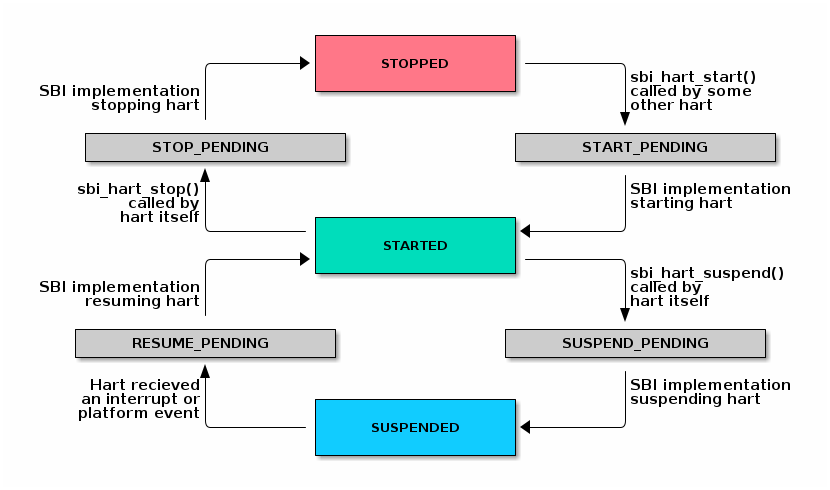

// SPDX-License-Identifier: CC-BY-4.0
[[riscv-doc-template]]
:description: RISC-V SBI definition specification
:company: RISC-V
:revdate:  December 15, 2022
:revnumber: 2.0.0
:revremark: Draft
:url-riscv: http://riscv.org
:doctype: book
:preface-title: Preamble
:colophon:
:appendix-caption: Appendix
:title-logo-image: image:docs-resources/images/risc-v_logo.svg[pdfwidth=3.25in,align=center]
// Settings:
:experimental:
:reproducible:
:WaveDromEditorApp: wavedrom-cli
:icons: font
:lang: en
:listing-caption: Listing
:sectnums:
:sectnumlevels: 5
:toclevels: 5
:toc: left
:source-highlighter: pygments
ifdef::backend-pdf[]
:source-highlighter: coderay
endif::[]
:data-uri:
:hide-uri-scheme:
:stem: latexmath
:footnote:
:xrefstyle: short 

= RISC-V Supervisor Binary Interface Specification
:author: RISC-V Platform Runtime Services Task Group
:email: tech-prs@lists.riscv.org

// Preamble
[WARNING]
.This document is in the link:http://riscv.org/spec-state[Development state]
====
Assume everything can change but backward compatibility with perviously
ratified specification will be maintained.
====

// table of contents
toc::[]

[preface]
== Copyright and license information

This RISC-V SBI specification is (C) 2022 RISC-V International.

It is licensed under the Creative Commons Attribution 4.0 International
License (CC-BY 4.0). The full license text is available at
https://creativecommons.org/licenses/by/4.0/.

[preface]
== Change Log

=== Version 1.0.0
* Updated the version for ratification

=== Version 1.0-rc3
* Updated the calling convention
* Fixed a typo in PMU extension
* Added a abbreviation table

=== Version 1.0-rc2
* Update to RISC-V formatting
* Improved the introduction
* Removed all references to RV32

=== Version 1.0-rc1
* A typo fix

=== Version 0.3.0
* Few typo fixes
* Updated the LICENSE with detailed text instead of a hyperlink

=== Version 0.3-rc1

* Improved document styling and naming conventions
* Added SBI system reset extension
* Improved SBI introduction section
* Improved documentation of SBI hart state management extension
* Added suspend function to SBI hart state management extension
* Added performance monitoring unit extension
* Clarified that an SBI extension shall not be partially implemented

=== Version 0.2

* The entire v0.1 SBI has been moved to the legacy extension, which is now
  an optional extension. This is technically a backwards-incompatible change
  because the legacy extension is optional and v0.1 of the SBI doesn't allow
  probing, but it's as good as we can do.

== Introduction

This specification describes the RISC-V Supervisor Binary Interface, known
from here on as SBI. The SBI allows supervisor-mode (S-mode or VS-mode)
software to be portable across all RISC-V implementations by defining an
abstraction for platform (or hypervisor) specific functionality. The design
of the SBI follows the general RISC-V philosophy of having a small core along
with a set of optional modular extensions.

SBI extensions as whole are optional but they shall not be partially
implemented. If sbi_probe_extension() signals that an extension is available,
all functions present in the SBI version reported by sbi_get_spec_version()
must conform to that version of the SBI specification.

The higher privilege software providing SBI interface to the supervisor-mode
software is referred as an SBI implementation or Supervisor Execution
Environment (SEE). An SBI implementation (or SEE) can be platform runtime
firmware executing in machine-mode (M-mode) (see below <<fig_intro1>>) or
it can be some hypervisor executing in hypervisor-mode (HS-mode) (see below
<<fig_intro2>>).

[#fig_intro1]
.RISC-V System without H-extension

[#fig_intro2]
.RISC-V System with H-extension
image::riscv-sbi-intro2.png[width=800,height=350]

The SBI specification doesn’t specify any method for hardware discovery.
The supervisor software must rely on the other industry standard hardware
discovery methods (i.e. Device Tree or ACPI) for that.

== Terms and Abbreviations

This specification uses the following terms and abbreviations:

[width=80%]
|===
| Term  | Meaning

| SBI   | Supervisor Binary Interface
| SEE   | Supervisor Execution Environment
| EID   | Extension ID
| FID   | Function ID
| HSM   | Hart State Management
| PMU   | Performance Monitoring Unit
| IPI   | Inter Processor Interrupt
| ASID  | Address Space Identifier
| VMID  | Virtual Machine Identifier
|===

== Binary Encoding

All SBI functions share a single binary encoding, which facilitates the mixing
of SBI extensions. The SBI specification follows the below calling convention.

* An `ECALL` is used as the control transfer instruction between the supervisor
  and the SEE.

* `a7` encodes the SBI extension ID (*EID*),

* `a6` encodes the SBI function ID (*FID*) for a given extension ID encoded
   in `a7` for any SBI extension defined in or after SBI v0.2.

* All registers except `a0` & `a1` must be preserved across an SBI call by the
  callee.

* SBI functions must return a pair of values in `a0` and `a1`, with `a0`
returning an error code. This is analogous to returning the C structure

[source, C]
----
    struct sbiret {
        long error;
        long value;
    };
----

In the name of compatibility, SBI extension IDs (*EIDs*) and SBI function IDs
(*FIDs*) are encoded as signed 32-bit integers. When passed in registers these
follow the standard above calling convention rules.

The <<table_standard_sbi_errors>> below provides a list of Standard SBI
error codes.

[#table_standard_sbi_errors]
.Standard SBI Errors
[cols="4,1", width=70%, align="center", options="header"]
|===
|  Error Type                |Value
|  SBI_SUCCESS               |  0
|  SBI_ERR_FAILED            | -1
|  SBI_ERR_NOT_SUPPORTED     | -2
|  SBI_ERR_INVALID_PARAM     | -3
|  SBI_ERR_DENIED            | -4
|  SBI_ERR_INVALID_ADDRESS   | -5
|  SBI_ERR_ALREADY_AVAILABLE | -6
|  SBI_ERR_ALREADY_STARTED   | -7
|  SBI_ERR_ALREADY_STOPPED   | -8
|===

An `ECALL` with an unsupported SBI extension ID (*EID*) or an unsupported SBI
function ID (*FID*) must return the error code `SBI_ERR_NOT_SUPPORTED`.

Every SBI function should prefer `unsigned long` as the data type. It keeps
the specification simple and easily adaptable for all RISC-V ISA types.
In case the data is defined as 32bit wide, higher privilege software must
ensure that it only uses 32 bit data only.

=== HART list parameter

If an SBI function needs to pass a list of harts to the higher privilege mode,
it must use a hart mask as defined below. This is applicable to any extensions
defined in or after v0.2.

Any function, requiring a hart mask, need to pass following two arguments.

* `unsigned long hart_mask` is a scalar bit-vector containing hartids
* `unsigned long hart_mask_base` is the starting hartid from which bit-vector
   must be computed.

In a single SBI function call, maximum number harts that can be set is
always XLEN. If a lower privilege mode needs to pass information about more
than XLEN harts, it should invoke multiple instances of the SBI function
call. `hart_mask_base` can be set to `-1` to indicate that `hart_mask` can
be ignored and all available harts must be considered.

Any function using hart mask may return error values listed in the
<<table_hart_mask_errors>> below which are in addition to function
specific error values.

[#table_hart_mask_errors]
.HART Mask Errors
[cols="1,2", width=90%, align="center", options="header"]
|===
| Error code            | Description
| SBI_ERR_INVALID_PARAM | Either `hart_mask_base` or any of the hartid from
                          `hart_mask` is not valid i.e. either the hartid is
                           not enabled by the platform or is not available to
                          the supervisor.
|===

== Base Extension (EID #0x10)

The base extension is designed to be as small as possible. As such, it only
contains functionality for probing which SBI extensions are available and for
querying the version of the SBI. All functions in the base extension must be
supported by all SBI implementations, so there are no error returns defined.

=== Function: Get SBI specification version (FID #0)

[source, C]
----
struct sbiret sbi_get_spec_version(void);
----

Returns the current SBI specification version. This function must always
succeed. The minor number of the SBI specification is encoded in the low 24
bits, with the major number encoded in the next 7 bits. Bit 31 must be 0 and
is reserved for future expansion.

=== Function: Get SBI implementation ID (FID #1)

[source, C]
----
struct sbiret sbi_get_impl_id(void);
----

Returns the current SBI implementation ID, which is different for every SBI
implementation. It is intended that this implementation ID allows software to
probe for SBI implementation quirks.

=== Function: Get SBI implementation version (FID #2)

[source, C]
----
struct sbiret sbi_get_impl_version(void);
----

Returns the current SBI implementation version. The encoding of this version
number is specific to the SBI implementation.

=== Function: Probe SBI extension (FID #3)

[source, C]
----
struct sbiret sbi_probe_extension(long extension_id);
----

Returns 0 if the given SBI extension ID (EID) is not available, or 1 if it is
available unless defined as any other non-zero value by the implementation.

=== Function: Get machine vendor ID (FID #4)

[source, C]
----
struct sbiret sbi_get_mvendorid(void);
----

Return a value that is legal for the `mvendorid` CSR and 0 is always a legal
value for this CSR.

=== Function: Get machine architecture ID (FID #5)

[source, C]
----
struct sbiret sbi_get_marchid(void);
----

Return a value that is legal for the `marchid` CSR and 0 is always a legal
value for this CSR.

=== Function: Get machine implementation ID (FID #6)

[source, C]
----
struct sbiret sbi_get_mimpid(void);
----

Return a value that is legal for the `mimpid` CSR and 0 is always a legal
value for this CSR.

=== Function Listing

[#table_base_function_list]
.Base Function List
[cols="3,2,1,1", width=70%, align="center", options="header"]
|===
| Function Name            | SBI Version | FID | EID
| sbi_get_sbi_spec_version | 0.2         |   0 | 0x10
| sbi_get_sbi_impl_id      | 0.2         |   1 | 0x10
| sbi_get_sbi_impl_version | 0.2         |   2 | 0x10
| sbi_probe_extension      | 0.2         |   3 | 0x10
| sbi_get_mvendorid        | 0.2         |   4 | 0x10
| sbi_get_marchid          | 0.2         |   5 | 0x10
| sbi_get_mimpid           | 0.2         |   6 | 0x10
|===

=== SBI Implementation IDs

[#table_sbi_implementation_ids]
.SBI Implementation IDs
[cols="1,2", width=70%, align="center", options="header"]
|===
| Implementation ID | Name
| 0                 | Berkeley Boot Loader (BBL)
| 1                 | OpenSBI
| 2                 | Xvisor
| 3                 | KVM
| 4                 | RustSBI
| 5                 | Diosix
| 6                 | Coffer
|===

== Legacy Extensions (EIDs #0x00 - #0x0F)

The legacy SBI extensions follow a slightly different calling convention
as compared to the SBI v0.2 (or higher) specification where:

* The SBI function ID field in `a6` register is ignored because these are
  encoded as multiple SBI extension IDs.
* Nothing is returned in `a1` register.
* All registers except `a0` must be preserved across an SBI call by the
  callee.
* The value returned in `a0` register is SBI legacy extension specific.

The page and access faults taken by the SBI implementation while accessing
memory on behalf of the supervisor are redirected back to the supervisor
with `sepc` CSR pointing to the faulting `ECALL` instruction.

The legacy SBI extensions is deprecated in favor of the other extensions
listed below. The legacy console SBI functions (`sbi_console_getchar()`
and `sbi_console_putchar()`) are expected to be deprecated; they have
no replacement.

=== Extension: Set Timer (EID #0x00)

[source, C]
----
long sbi_set_timer(uint64_t stime_value)
----

Programs the clock for next event after *stime_value* time. This function
also clears the pending timer interrupt bit.

If the supervisor wishes to clear the timer interrupt without scheduling
the next timer event, it can either request a timer interrupt infinitely
far into the future (i.e., (uint64_t)-1), or it can instead mask the timer
interrupt by clearing `sie.STIE` CSR bit.

This SBI call returns 0 upon success or an implementation specific negative
error code.

=== Extension: Console Putchar (EID #0x01)

[source, C]
----
long sbi_console_putchar(int ch)
----

Write data present in *ch* to debug console.

Unlike `sbi_console_getchar()`, this SBI call **will block** if there remain
any pending characters to be transmitted or if the receiving terminal is not
yet ready to receive the byte. However, if the console doesn't exist at all,
then the character is thrown away.

This SBI call returns 0 upon success or an implementation specific negative
error code.

=== Extension: Console Getchar (EID #0x02)

[source, C]
----
long sbi_console_getchar(void)
----

Read a byte from debug console.

The SBI call returns the byte on success, or -1 for failure.

=== Extension: Clear IPI (EID #0x03)

[source, C]
----
long sbi_clear_ipi(void)
----

Clears the pending IPIs if any. The IPI is cleared only in the hart for
which this SBI call is invoked. `sbi_clear_ipi()` is deprecated because
S-mode code can clear `sip.SSIP` CSR bit directly.

This SBI call returns 0 if no IPI had been pending, or an implementation
specific positive value if an IPI had been pending.

=== Extension: Send IPI (EID #0x04)

[source, C]
----
long sbi_send_ipi(const unsigned long *hart_mask)
----

Send an inter-processor interrupt to all the harts defined in hart_mask.
Interprocessor interrupts manifest at the receiving harts as Supervisor
Software Interrupts.

hart_mask is a virtual address that points to a bit-vector of harts. The
bit vector is represented as a sequence of unsigned longs whose length
equals the number of harts in the system divided by the number of bits
in an unsigned long, rounded up to the next integer.

This SBI call returns 0 upon success or an implementation specific negative
error code.

=== Extension: Remote FENCE.I (EID #0x05)

[source, C]
----
long sbi_remote_fence_i(const unsigned long *hart_mask)
----

Instructs remote harts to execute `FENCE.I` instruction. The `hart_mask`
is same as described in `sbi_send_ipi()`.

This SBI call returns 0 upon success or an implementation specific negative
error code.

=== Extension: Remote SFENCE.VMA (EID #0x06)

[source, C]
----
long sbi_remote_sfence_vma(const unsigned long *hart_mask,
                           unsigned long start,
                           unsigned long size)
----

Instructs the remote harts to execute one or more `SFENCE.VMA` instructions,
covering the range of virtual addresses between start and size.

This SBI call returns 0 upon success or an implementation specific negative
error code.

=== Extension: Remote SFENCE.VMA with ASID (EID #0x07)

[source, C]
----
long sbi_remote_sfence_vma_asid(const unsigned long *hart_mask,
                                unsigned long start,
                                unsigned long size,
                                unsigned long asid)
----

Instruct the remote harts to execute one or more `SFENCE.VMA` instructions,
covering the range of virtual addresses between start and size. This covers
only the given `ASID`.

This SBI call returns 0 upon success or an implementation specific negative
error code.

=== Extension: System Shutdown (EID #0x08)

[source, C]
----
void sbi_shutdown(void)
----

Puts all the harts to shutdown state from supervisor point of view.

This SBI call doesn't return irrespective whether it succeeds or fails.

=== Function Listing

[cols="3,1,1,2", width=80%, align="center", options="header"]

[#table_legacy_function_list]
.Legacy Function List
[cols="4,2,1,2,3", width=100%, align="center", options="header"]
|===
| Function Name             | SBI Version | FID | EID       | Replacement EID
| sbi_set_timer             | 0.1         |   0 | 0x00      | 0x54494D45
| sbi_console_putchar       | 0.1         |   0 | 0x01      | N/A
| sbi_console_getchar       | 0.1         |   0 | 0x02      | N/A
| sbi_clear_ipi             | 0.1         |   0 | 0x03      | N/A
| sbi_send_ipi              | 0.1         |   0 | 0x04      | 0x735049
| sbi_remote_fence_i        | 0.1         |   0 | 0x05      | 0x52464E43
| sbi_remote_sfence_vma     | 0.1         |   0 | 0x06      | 0x52464E43
| sbi_remote_sfence_vma_asid| 0.1         |   0 | 0x07      | 0x52464E43
| sbi_shutdown              | 0.1         |   0 | 0x08      | 0x53525354
| *RESERVED*                |             |     | 0x09-0x0F |
|===

== Timer Extension (EID #0x54494D45 "TIME")

This replaces legacy timer extension (EID #0x00). It follows the new calling
convention defined in v0.2.

=== Function: Set Timer (FID #0)

[source, C]
----
struct sbiret sbi_set_timer(uint64_t stime_value)
----

Programs the clock for next event after *stime_value* time. *stime_value*
is in absolute time. This function must clear the pending timer interrupt
bit as well.

If the supervisor wishes to clear the timer interrupt without scheduling
the next timer event, it can either request a timer interrupt infinitely
far into the future (i.e., (uint64_t)-1), or it can instead mask the timer
interrupt by clearing `sie.STIE` CSR bit.

=== Function Listing

[#table_time_function_list]
.TIME Function List
[cols="4,2,1,2", width=80%, align="center", options="header"]
|===
| Function Name | SBI Version | FID | EID
| sbi_set_timer | 0.2         | 0   | 0x54494D45
|===

== IPI Extension (EID #0x735049 "sPI: s-mode IPI")

This extension replaces the legacy extension (EID #0x04). The other IPI related
legacy extension(0x3) is deprecated now. All the functions in this extension
follow the `hart_mask` as defined in the binary encoding section.

=== Function: Send IPI (FID #0)

[source, C]
----
struct sbiret sbi_send_ipi(unsigned long hart_mask,
                           unsigned long hart_mask_base)
----

Send an inter-processor interrupt to all the harts defined in hart_mask.
Interprocessor interrupts manifest at the receiving harts as the supervisor
software interrupts.

The possible error codes returned in `sbiret.error` are shown in the
<<table_ipi_send_errors>> below.

[#table_ipi_send_errors]
.IPI Send Errors
[cols="2,3", width=90%, align="center", options="header"]
|===
| Error code  | Description
| SBI_SUCCESS | IPI was sent to all the targeted harts successfully.
|===

=== Function Listing

[#table_ipi_function_list]
.IPI Function List
[cols="4,2,1,2", width=80%, align="center", options="header"]
|===
| Function Name | SBI Version | FID | EID
| sbi_send_ipi  | 0.2         | 0   | 0x735049
|===

== RFENCE Extension (EID #0x52464E43 "RFNC")

This extension defines all remote fence related functions and replaces
the legacy extensions (EIDs #0x05 - #0x07). All the functions follow the
`hart_mask` as defined in binary encoding section. Any function wishes
to use range of addresses (i.e. start_addr and size), have to abide by
the below constraints on range parameters.

The remote fence function acts as a full TLB flush if

* `start_addr` and `size` are both 0
* `size` is equal to 2^XLEN-1

=== Function: Remote FENCE.I (FID #0)

[source, C]
----
struct sbiret sbi_remote_fence_i(unsigned long hart_mask,
                                 unsigned long hart_mask_base)
----
Instructs remote harts to execute `FENCE.I` instruction.

The possible error codes returned in `sbiret.error` are shown in the
<<table_rfence_remote_fence_i_errors>> below.

[#table_rfence_remote_fence_i_errors]
.RFENCE Remote FENCE.I Errors
[cols="2,3", width=90%, align="center", options="header"]
|===
| Error code  | Description
| SBI_SUCCESS | IPI was sent to all the targeted harts successfully.
|===

=== Function: Remote SFENCE.VMA (FID #1)

[source, C]
----
struct sbiret sbi_remote_sfence_vma(unsigned long hart_mask,
                                    unsigned long hart_mask_base,
                                    unsigned long start_addr,
                                    unsigned long size)
----

Instructs the remote harts to execute one or more `SFENCE.VMA` instructions,
covering the range of virtual addresses between start and size.

The possible error codes returned in `sbiret.error` are shown in the
<<table_rfence_remote_sfence_vma_errors>> below.

[#table_rfence_remote_sfence_vma_errors]
.RFENCE Remote SFENCE.VMA Errors
[cols="2,3", width=90%, align="center", options="header"]
|===
| Error code              | Description
| SBI_SUCCESS             | IPI was sent to all the targeted harts
                            successfully.
| SBI_ERR_INVALID_ADDRESS | `start_addr` or `size` is not valid.
|===

=== Function: Remote SFENCE.VMA with ASID (FID #2)

[source, C]
----
struct sbiret sbi_remote_sfence_vma_asid(unsigned long hart_mask,
                                         unsigned long hart_mask_base,
                                         unsigned long start_addr,
                                         unsigned long size,
                                         unsigned long asid)
----

Instruct the remote harts to execute one or more `SFENCE.VMA` instructions,
covering the range of virtual addresses between start and size. This covers
only the given `ASID`.

The possible error codes returned in `sbiret.error` are shown in the
<<table_rfence_remote_sfence_vma_asid_errors>> below.

[#table_rfence_remote_sfence_vma_asid_errors]
.RFENCE Remote SFENCE.VMA with ASID Errors
[cols="2,3", width=90%, align="center", options="header"]
|===
| Error code              | Description
| SBI_SUCCESS             | IPI was sent to all the targeted harts
                            successfully.
| SBI_ERR_INVALID_ADDRESS | `start_addr` or `size` is not valid.
|===

=== Function: Remote HFENCE.GVMA with VMID (FID #3)

[source, C]
----
struct sbiret sbi_remote_hfence_gvma_vmid(unsigned long hart_mask,
                                          unsigned long hart_mask_base,
                                          unsigned long start_addr,
                                          unsigned long size,
                                          unsigned long vmid)
----

Instruct the remote harts to execute one or more `HFENCE.GVMA` instructions,
covering the range of guest physical addresses between start and size only
for the given `VMID`. This function call is only valid for harts implementing
hypervisor extension.

The possible error codes returned in `sbiret.error` are shown in the
<<table_rfence_remote_hfence_gvma_vmid_errors>> below.

[#table_rfence_remote_hfence_gvma_vmid_errors]
.RFENCE Remote HFENCE.GVMA with VMID Errors
[cols="2,3", width=90%, align="center", options="header"]
|===
| Error code              | Description
| SBI_SUCCESS             | IPI was sent to all the targeted harts
                            successfully.
| SBI_ERR_NOT_SUPPORTED   | This function is not supported as it is not
                            implemented or one of the target hart doesn't
                            support hypervisor extension.
| SBI_ERR_INVALID_ADDRESS | `start_addr` or `size` is not valid.
|===

=== Function: Remote HFENCE.GVMA (FID #4)

[source, C]
----
struct sbiret sbi_remote_hfence_gvma(unsigned long hart_mask,
                                     unsigned long hart_mask_base,
                                     unsigned long start_addr,
                                     unsigned long size)
----

Instruct the remote harts to execute one or more `HFENCE.GVMA` instructions,
covering the range of guest physical addresses between start and size for all
the guests. This function call is only valid for harts implementing hypervisor
extension.

The possible error codes returned in `sbiret.error` are shown in the
<<table_rfence_remote_hfence_gvma_errors>> below.

[#table_rfence_remote_hfence_gvma_errors]
.RFENCE Remote HFENCE.GVMA Errors
[cols="2,3", width=90%, align="center", options="header"]
|===
| Error code              | Description
| SBI_SUCCESS             | IPI was sent to all the targeted harts
                            successfully.
| SBI_ERR_NOT_SUPPORTED   | This function is not supported as it is not
                            implemented or one of the target hart doesn't
                            support hypervisor extension.
| SBI_ERR_INVALID_ADDRESS | `start_addr` or `size` is not valid.
|===

=== Function: Remote HFENCE.VVMA with ASID (FID #5)

[source, C]
----
struct sbiret sbi_remote_hfence_vvma_asid(unsigned long hart_mask,
                                          unsigned long hart_mask_base,
                                          unsigned long start_addr,
                                          unsigned long size,
                                          unsigned long asid)
----

Instruct the remote harts to execute one or more `HFENCE.VVMA` instructions,
covering the range of guest virtual addresses between start and size for the
given `ASID` and current `VMID` (in `hgatp` CSR) of calling hart. This function
call is only valid for harts implementing hypervisor extension.

The possible error codes returned in `sbiret.error` are shown in the
<<table_rfence_remote_hfence_vvma_asid_errors>> below.

[#table_rfence_remote_hfence_vvma_asid_errors]
.RFENCE Remote HFENCE.VVMA with ASID Errors
[cols="2,3", width=90%, align="center", options="header"]
|===
| Error code              | Description
| SBI_SUCCESS             | IPI was sent to all the targeted harts
                            successfully.
| SBI_ERR_NOT_SUPPORTED   | This function is not supported as it is not
                            implemented or one of the target hart doesn't
                            support hypervisor extension.
| SBI_ERR_INVALID_ADDRESS | `start_addr` or `size` is not valid.
|===

=== Function: Remote HFENCE.VVMA (FID #6)

[source, C]
----
struct sbiret sbi_remote_hfence_vvma(unsigned long hart_mask,
                                     unsigned long hart_mask_base,
                                     unsigned long start_addr,
                                     unsigned long size)
----

Instruct the remote harts to execute one or more `HFENCE.VVMA` instructions,
covering the range of guest virtual addresses between start and size for
current `VMID` (in `hgatp` CSR) of calling hart. This function call is only
valid for harts implementing hypervisor extension.

The possible error codes returned in `sbiret.error` are shown in the
<<table_rfence_remote_hfence_vvma_errors>> below.

[#table_rfence_remote_hfence_vvma_errors]
.RFENCE Remote HFENCE.VVMA Errors
[cols="2,3", width=90%, align="center", options="header"]
|===
| Error code              | Description
| SBI_SUCCESS             | IPI was sent to all the targeted harts
                            successfully.
| SBI_ERR_NOT_SUPPORTED   | This function is not supported as it is not
                            implemented or one of the target hart doesn't
                            support hypervisor extension.
| SBI_ERR_INVALID_ADDRESS | `start_addr` or `size` is not valid.
|===

=== Function Listing

[#table_rfence_function_list]
.RFENCE Function List
[cols="4,2,1,2", width=80%, align="center", options="header"]
|===
| Function Name               | SBI Version | FID | EID
| sbi_remote_fence_i          | 0.2         | 0   | 0x52464E43
| sbi_remote_sfence_vma       | 0.2         | 1   | 0x52464E43
| sbi_remote_sfence_vma_asid  | 0.2         | 2   | 0x52464E43
| sbi_remote_hfence_gvma_vmid | 0.2         | 3   | 0x52464E43
| sbi_remote_hfence_gvma      | 0.2         | 4   | 0x52464E43
| sbi_remote_hfence_vvma_asid | 0.2         | 5   | 0x52464E43
| sbi_remote_hfence_vvma      | 0.2         | 6   | 0x52464E43
|===

== Hart State Management Extension (EID #0x48534D "HSM")

The Hart State Management (HSM) Extension introduces a set of hart states and a
set of functions which allow the supervisor-mode software to request a hart
state change.

The <<table_hsm_states>> shown below describes all possible **HSM states**
along with a unique **HSM state id** for each state:

[#table_hsm_states]
.HSM Hart States
[cols="1,2,4", width=100%, align="center", options="header"]
|===
| State ID | State Name      | Description
| 0        | STARTED         | The hart is physically powered-up and executing
                               normally.
| 1        | STOPPED         | The hart is not executing in supervisor-mode
                               or any lower privilege mode. It is probably
                               powered-down by the SBI implementation if the
                               underlying platform has a mechanism to
                               physically power-down harts.
| 2        | START_PENDING   | Some other hart has requested to start (or
                               power-up) the hart from the **STOPPED** state
                               and the SBI implementation is still working to
                               get the hart in the **STARTED** state.
| 3        | STOP_PENDING    | The hart has requested to stop (or power-down)
                               itself from the **STARTED** state and the SBI
                               implementation is still working to get the hart
                               in the **STOPPED** state.
| 4        | SUSPENDED       | This hart is in a platform specific suspend
                               (or low power) state.
| 5        | SUSPEND_PENDING | The hart has requested to put itself in a
                               platform specific low power state from the
                               **STARTED** state and the SBI implementation
                               is still working to get the hart in the
                               platform specific **SUSPENDED** state.
| 6        | RESUME_PENDING  | An interrupt or platform specific hardware
                               event has caused the hart to resume normal
                               execution from the **SUSPENDED** state and
                               the SBI implementation is still working to
                               get the hart in the **STARTED** state.
|===

At any point in time, a hart should be in one of the above mentioned hart
states. The hart state transitions by the SBI implementation should follow
the state machine shown below in the <<figure_hsm>>.

[#figure_hsm]
.SBI HSM State Machine

A platform can have multiple harts grouped into hierarchical topology
groups (namely cores, clusters, nodes, etc.) with separate platform specific
low-power states for each hierarchical group. These platform specific
low-power states of hierarchical topology groups can be represented as
platform specific suspend states of a hart. An SBI implementation can
utilize the suspend states of higher topology groups using one of the
following approaches:

. *Platform-coordinated:* In this approach, when a hart becomes idle the
  supervisor-mode power-managment software will request deepest suspend
  state for the hart and higher topology groups. An SBI implementation
  should choose a suspend state at higher topology group which is:
.. Not deeper than the specified suspend state
.. Wake-up latency is not higher than the wake-up latency of the
   specified suspend state
. *OS-inititated:* In this approach, the supervisor-mode power-managment
  software will directly request a suspend state for higher topology group
  after the last hart in that group becomes idle. When a hart becomes idle,
  the supervisor-mode power-managment software will always select suspend
  state for the hart itself but it will select a suspend state for a higher
  topology group only if the hart is the last running hart in the group.
  An SBI implementation should:
.. Never choose a suspend state for higher topology group different from
   the specified suspend state
.. Always prefer most recent suspend state requested for higher topology
   group

=== Function: HART start (FID #0)

[source, C]
----
struct sbiret sbi_hart_start(unsigned long hartid,
                             unsigned long start_addr,
                             unsigned long opaque)
----

Request the SBI implementation to start executing the target hart in
supervisor-mode at address specified by `start_addr` parameter with
specific registers values described in the <<table_hsm_hart_start_regs>>
below.

[#table_hsm_hart_start_regs]
.HSM Hart Start Register State
[cols=",", width=80%, align="center", options="header"]
|===
|Register Name | Register Value
|satp          | 0
|sstatus.SIE   | 0
|a0            | hartid
|a1            | `opaque` parameter
2+|All other registers remain in an undefined state.
|===

This call is asynchronous -- more specifically, the `sbi_hart_start()` may
return before the target hart starts executing as long as the SBI implementation
is capable of ensuring the return code is accurate.
If the SBI implementation is a platform runtime firmware executing in
machine-mode (M-mode) then it MUST configure PMP and other M-mode state
before transferring control to supervisor-mode software.

The `hartid` parameter specifies the target hart which is to be started.

The `start_addr` parameter points to a runtime-specified physical address,
where the hart can start executing in supervisor-mode.

The `opaque` parameter is an XLEN-bit value which will be set in the `a1`
register when the hart starts executing at `start_addr`.

The possible error codes returned in `sbiret.error` are shown in the
<<table_hsm_hart_start_errors>> below.

[#table_hsm_hart_start_errors]
.HSM Hart Start Errors
[cols="1,2", width=100%, align="center", options="header"]
|===
| Error code                | Description
| SBI_SUCCESS               | Hart was previously in stopped state. It will
                              start executing from `start_addr`.
| SBI_ERR_INVALID_ADDRESS   | `start_addr` is not valid possibly due to
                              following reasons: +
                              * It is not a valid physical address. +
                              * The address is prohibited by PMP to run in
                                supervisor mode.
| SBI_ERR_INVALID_PARAM     | `hartid` is not a valid hartid as the
                              corresponding hart cannot be started in supervisor
                              mode.
| SBI_ERR_ALREADY_AVAILABLE | The given hartid is already started.
| SBI_ERR_FAILED            | The start request failed for unknown reasons.
|===

=== Function: HART stop (FID #1)

[source, C]
----
struct sbiret sbi_hart_stop(void)
----

Request the SBI implementation to stop executing the calling hart in
supervisor-mode and return its ownership to the SBI implementation.
This call is not expected to return under normal conditions. The
`sbi_hart_stop()` must be called with supervisor-mode interrupts disabled.

The possible error codes returned in `sbiret.error` are shown in the
<<table_hsm_hart_stop_errors>> below.

[#table_hsm_hart_stop_errors]
.HSM Hart Stop Errors
[cols="1,2", width=100%, align="center", options="header"]
|===
| Error code     | Description
| SBI_ERR_FAILED | Failed to stop execution of the current hart
|===

=== Function: HART get status (FID #2)

[source, C]
----
struct sbiret sbi_hart_get_status(unsigned long hartid)
----

Get the current status (or HSM state id) of the given hart in `sbiret.value`,
or an error through `sbiret.error`.

The `hartid` parameter specifies the target hart for which status is
required.

The possible status (or HSM state id) values returned in `sbiret.value`
are described in <<table_hsm_states>>.

The possible error codes returned in `sbiret.error` are shown in the
<<table_hsm_hart_get_status_errors>> below.

[#table_hsm_hart_get_status_errors]
.HSM Hart Get Status Errors
[cols="1,2", width=100%, align="center", options="header"]
|===
| Error code            | Description
| SBI_ERR_INVALID_PARAM | The given `hartid` is not valid
|===

The harts may transition HSM states at any time due to any concurrent
`sbi_hart_start()` or `sbi_hart_stop()` or `sbi_hart_suspend()` calls,
the return value from this function may not represent the actual state
of the hart at the time of return value verification.

=== Function: HART suspend (FID #3)

[source, C]
----
struct sbiret sbi_hart_suspend(uint32_t suspend_type,
                               unsigned long resume_addr,
                               unsigned long opaque)
----

Request the SBI implementation to put the calling hart in a platform specific
suspend (or low power) state specified by the `suspend_type` parameter. The
hart will automatically come out of suspended state and resume normal
execution when it receives an interrupt or platform specific hardware event.

The platform specific suspend states for a hart can be either retentive
or non-retentive in nature. A retentive suspend state will preserve hart
register and CSR values for all privilege modes whereas a non-retentive
suspend state will not preserve hart register and CSR values.

Resuming from a retentive suspend state is straight forward and the
supervisor-mode software will see SBI suspend call return without any
failures.  The `resume_addr` parameter is unused during retentive suspend.

Resuming from a non-retentive suspend state is relatively more involved and
requires software to restore various hart registers and CSRs for all privilege
modes. Upon resuming from non-retentive suspend state, the hart will jump to
supervisor-mode at address specified by `resume_addr` with specific registers
values described in the <<table_hsm_hart_resume_regs>> below.

[#table_hsm_hart_resume_regs]
.HSM Hart Resume Register State
[cols=",", width=80%, align="center", options="header"]
|===
|Register Name | Register Value
|satp          | 0
|sstatus.SIE   | 0
|a0            | hartid
|a1            | `opaque` parameter
2+|All other registers remain in an undefined state.
|===

The `suspend_type` parameter is 32 bits wide and the possible values are
shown in <<table_hsm_hart_suspend_types>> below.

[#table_hsm_hart_suspend_types]
.HSM Hart Suspend Types
[cols="1,2", width=90%, align="center", options="header"]
|===
| Value                   | Description
| 0x00000000              | Default retentive suspend
| 0x00000001 - 0x0FFFFFFF | Reserved for future use
| 0x10000000 - 0x7FFFFFFF | Platform specific retentive suspend
| 0x80000000              | Default non-retentive suspend
| 0x80000001 - 0x8FFFFFFF | Reserved for future use
| 0x90000000 - 0xFFFFFFFF | Platform specific non-retentive suspend
| > 0xFFFFFFFF            | Reserved
|===

The `resume_addr` parameter points to a runtime-specified physical address,
where the hart can resume execution in supervisor-mode after a non-retentive
suspend.

The `opaque` parameter is an XLEN-bit value which will be set in the `a1`
register when the hart resumes execution at `resume_addr` after a
non-retentive suspend.

The possible error codes returned in `sbiret.error` are shown in the
<<table_hsm_hart_suspend_errors>> below.

[#table_hsm_hart_suspend_errors]
.HSM Hart Suspend Errors
[cols="1,2", width=100%, align="center", options="header"]
|===
| Error code              | Description
| SBI_SUCCESS             | Hart has suspended and resumed back successfully
                            from a retentive suspend state.
| SBI_ERR_INVALID_PARAM   | `suspend_type` is not valid.
| SBI_ERR_NOT_SUPPORTED   | `suspend_type` is valid but not implemented.
| SBI_ERR_INVALID_ADDRESS | `resume_addr` is not valid possibly due to
                            following reasons: +
                            * It is not a valid physical address. +
                            * The address is prohibited by PMP to run in
                              supervisor mode.
| SBI_ERR_FAILED          | The suspend request failed for unknown reasons.
|===

=== Function Listing

[#table_hsm_function_list]
.HSM Function List
[cols="3,2,1,2", width=80%, align="center", options="header"]
|===
| Function Name       | SBI Version | FID | EID
| sbi_hart_start      | 0.2         |  0  | 0x48534D
| sbi_hart_stop       | 0.2         |  1  | 0x48534D
| sbi_hart_get_status | 0.2         |  2  | 0x48534D
| sbi_hart_suspend    | 0.3         |  3  | 0x48534D
|===

== System Reset Extension (EID #0x53525354 "SRST")

The System Reset Extension provides a function that allow the supervisor
software to request system-level reboot or shutdown. The term "system"
refers to the world-view of supervisor software and the underlying SBI
implementation could be machine mode firmware or hypervisor.

=== Function: System reset (FID #0)

[source, C]
----
struct sbiret sbi_system_reset(uint32_t reset_type, uint32_t reset_reason)
----

Reset the system based on provided `reset_type` and `reset_reason`. This is
a synchronous call and does not return if it succeeds.

The `reset_type` parameter is 32 bits wide and it's possible values are shown
in the <<table_srst_system_reset_types>> below.

[#table_srst_system_reset_types]
.SRST System Reset Types
[cols="1,2", width=90%, align="center", options="header"]
|===
| Value                   | Description
| 0x00000000              | Shutdown
| 0x00000001              | Cold reboot
| 0x00000002              | Warm reboot
| 0x00000003 - 0xEFFFFFFF | Reserved for future use
| 0xF0000000 - 0xFFFFFFFF | Vendor or platform specific reset type
| > 0xFFFFFFFF            | Reserved
|===

The `reset_reason` is an optional parameter representing the reason for
system reset. This parameter is 32 bits wide with possible values shown
in the <<table_srst_system_reset_reasons>> below

[#table_srst_system_reset_reasons]
.SRST System Reset Reasons
[cols="1,2", width=90%, align="center", options="header"]
|===
| Value                   | Description
| 0x00000000              | No reason
| 0x00000001              | System failure
| 0x00000002 - 0xDFFFFFFF | Reserved for future use
| 0xE0000000 - 0xEFFFFFFF | SBI implementation specific reset reason
| 0xF0000000 - 0xFFFFFFFF | Vendor or platform specific reset reason
| > 0xFFFFFFFF            | Reserved
|===

When supervisor software is running natively, the SBI implementation is
machine mode firmware. In this case, shutdown is equivalent to physical
power down of the entire system and cold reboot is equivalent to physical
power cycle of the entire system. Further, warm reboot is equivalent to
a power cycle of main processor and parts of the system but not the entire
system. For example, on a server class system with a BMC (board management
controller), a warm reboot will not power cycle the BMC whereas a cold
reboot will definitely power cycle the BMC.

When supervisor software is running inside a virtual machine, the SBI
implementation is a hypervisor. The shutdown, cold reboot and warm reboot
will behave functionally the same as the native case but might not result
in any physical power changes.

The possible error codes returned in `sbiret.error` are shown in the
<<table_srst_system_reset_errors>> below.

[#table_srst_system_reset_errors]
.SRST System Reset Errors
[cols="1,2", width=100%, align="center", options="header"]
|===
| Error code            | Description
| SBI_ERR_INVALID_PARAM | `reset_type` or `reset_reason` is not valid.
| SBI_ERR_NOT_SUPPORTED | `reset_type` is valid but not implemented.
| SBI_ERR_FAILED        | Reset request failed for unknown reasons.
|===

=== Function Listing

[#table_srst_function_list]
.SRST Function List
[cols="3,2,1,2", width=80%, align="center", options="header"]
|===
| Function Name       | SBI Version | FID | EID
| sbi_system_reset    | 0.3         |   0 | 0x53525354
|===

== Performance Monitoring Unit Extension (EID #0x504D55 "PMU")

The RISC-V hardware performance counters such as `mcycle`, `minstret`, and
`mhpmcounterX` CSRs are accessible as read-only from supervisor-mode using
`cycle`, `instret`, and `hpmcounterX` CSRs. The SBI performance monitoring
unit (PMU) extension is an interface for supervisor-mode to configure and
use the RISC-V hardware performance counters with assistance from the
machine-mode (or hypervisor-mode). These hardware performance counters
can only be started, stopped, or configured from machine-mode using
`mcountinhibit` and `mhpmeventX` CSRs. Due to this, a machine-mode SBI
implementation may choose to disallow SBI PMU extension if `mcountinhibit`
CSR is not implemented by the RISC-V platform.

A RISC-V platform generally supports monitoring of various hardware events
using a limited number of hardware performance counters which are up to
64 bits wide. In addition, a SBI implementation can also provide firmware
performance counters which can monitor firmware events such as number of
misaligned load/store instructions, number of RFENCEs, number of IPIs, etc.
The firmware counters are always 64 bits wide.

The SBI PMU extension provides:

1. An interface for supervisor-mode software to discover and configure
   per-HART hardware/firmware counters
2. A typical https://en.wikipedia.org/wiki/Perf_(Linux)[perf] compatible
   interface for hardware/firmware performance counters and events
3. Full access to microarchitecture's raw event encodings

To define SBI PMU extension calls, we first define important entities
`counter_idx`, `event_idx`, and `event_data`. The `counter_idx` is a
logical number assigned to each hardware/firmware counter. The `event_idx`
represents a hardware (or firmware) event whereas the `event_data` is
64 bits wide and represents additional configuration (or parameters) for
a hardware (or firmware) event.

The event_idx is a 20 bits wide number encoded as follows:
[source, C]
----
    event_idx[19:16] = type
    event_idx[15:0] = code
----

=== Event: Hardware general events (Type #0)

The `event_idx.type` (i.e. *event type*) should be `0x0` for all hardware
general events and each hardware general event is identified by an unique
`event_idx.code` (i.e. *event code*) described in the
<<table_pmu_hardware_events>> below.

[#table_pmu_hardware_events]
.PMU Hardware Events
[cols="6,1,4", width=95%, align="center", options="header"]
|===
| General Event Name                 | Code | Description
| SBI_PMU_HW_NO_EVENT                |    0 | Unused event because
                                              `event_idx` cannot be zero
| SBI_PMU_HW_CPU_CYCLES              |    1 | Event for each CPU cycle
| SBI_PMU_HW_INSTRUCTIONS            |    2 | Event for each completed
                                              instruction
| SBI_PMU_HW_CACHE_REFERENCES        |    3 | Event for cache hit
| SBI_PMU_HW_CACHE_MISSES            |    4 | Event for cache miss
| SBI_PMU_HW_BRANCH_INSTRUCTIONS     |    5 | Event for a branch instruction
| SBI_PMU_HW_BRANCH_MISSES           |    6 | Event for a branch misprediction
| SBI_PMU_HW_BUS_CYCLES              |    7 | Event for each BUS cycle
| SBI_PMU_HW_STALLED_CYCLES_FRONTEND |    8 | Event for a stalled cycle in
                                              microarchitecture frontend
| SBI_PMU_HW_STALLED_CYCLES_BACKEND  |    9 | Event for a stalled cycle in
                                              microarchitecture backend
| SBI_PMU_HW_REF_CPU_CYCLES          |   10 | Event for each reference
                                              CPU cycle
|===

*NOTE:* The `event_data` (i.e. *event data*) is unused for hardware
general events and all non-zero values of `event_data` are reserved
for future use.

*NOTE:* A RISC-V platform might halt the CPU clock when it enters WAIT
state using the WFI instruction or enters platform specific SUSPEND state
using the SBI HSM HART suspend call.

*NOTE:* The *SBI_PMU_HW_CPU_CYCLES* event counts CPU clock cycles as
counted by the `cycle` CSR. These may be variable frequency cycles, and
are not counted when the CPU clock is halted.

*NOTE:* The *SBI_PMU_HW_REF_CPU_CYCLES* counts fixed-frequency clock
cycles while the CPU clock is not halted. The fixed-frequency of counting
might, for example, be the same frequency at which the `time` CSR counts.

*NOTE:* The *SBI_PMU_HW_BUS_CYCLES* counts fixed-frequency clock cycles.
The fixed-frequency of counting might be the same frequency at which the
`time` CSR counts, or may be the frequency of the clock at the boundary
between the HART (and it's private caches) and the rest of the system.

=== Event: Hardware cache events (Type #1)

The `event_idx.type` (i.e. *event type*) should be `0x1` for all hardware
cache events and each hardware cache event is identified by an unique
`event_idx.code` (i.e. *event code*) which is encoded as follows:

[source, C]
----
    event_idx.code[15:3] = cache_id
    event_idx.code[2:1] = op_id
    event_idx.code[0:0] = result_id
----

Below tables show possible values of: `event_idx.code.cache_id` (i.e.
*cache event id*), `event_idx.code.op_id` (i.e. *cache operation id*)
and `event_idx.code.result_id` (i.e. *cache result id*).

[#table_pmu_cache_event_id]
.PMU Cache Event ID
[cols="6,2,4", width=95%, align="center", options="header"]
|===
| Cache Event Name      | Event ID | Description
| SBI_PMU_HW_CACHE_L1D  |        0 | Level1 data cache event
| SBI_PMU_HW_CACHE_L1I  |        1 | Level1 instruction cache event
| SBI_PMU_HW_CACHE_LL   |        2 | Last level cache event
| SBI_PMU_HW_CACHE_DTLB |        3 | Data TLB event
| SBI_PMU_HW_CACHE_ITLB |        4 | Instruction TLB event
| SBI_PMU_HW_CACHE_BPU  |        5 | Branch predictor unit event
| SBI_PMU_HW_CACHE_NODE |        6 | NUMA node cache event
|===

[#table_pmu_cache_ops_id]
.PMU Cache Operation ID
[cols="6,2,4", width=95%, align="center", options="header"]
|===
| Cache Operation Name         | Operation ID | Description
| SBI_PMU_HW_CACHE_OP_READ     |            0 | Read cache line
| SBI_PMU_HW_CACHE_OP_WRITE    |            1 | Write cache line
| SBI_PMU_HW_CACHE_OP_PREFETCH |            2 | Prefetch cache line
|===

[#table_pmu_cache_result_id]
.PMU Cache Operation Result ID
[cols="6,2,4", width=95%, align="center", options="header"]
|===
| Cache Result Name              | Result ID | Description
| SBI_PMU_HW_CACHE_RESULT_ACCESS |         0 | Cache access
| SBI_PMU_HW_CACHE_RESULT_MISS   |         1 | Cache miss
|===

*NOTE:* The `event_data` (i.e. *event data*) is unused for hardware cache
events and all non-zero values of `event_data` are reserved for future use.

=== Event: Hardware raw events (Type #2)

The `event_idx.type` (i.e. *event type*) should be `0x2` for all hardware
raw events and `event_idx.code` (i.e. *event code*) should be zero.

On RISC-V platform with 32 bits wide `mhpmeventX` CSRs, the `event_data`
configuration (or parameter) should have the 32-bit value to to be programmed
in the `mhpmeventX` CSR.

On RISC-V platform with 64 bits wide `mhpmeventX` CSRs, the `event_data`
configuration (or parameter) should have the 48-bit value to to be programmed
in the lower 48-bits of `mhpmeventX` CSR and the SBI implementation shall
determine the value to be programmed in the upper 16 bits of `mhpmeventX`
CSR.

*Note:* The RISC-V platform hardware implementation may choose to define
the expected value to be written to `mhpmeventX` CSR for a hardware event.
In case of hardware general/cache events, the RISC-V platform hardware
implementation may use the zero-extended `event_idx` as the expected
value for simplicity.

=== Event: Firmware events (Type #15)

The `event_idx.type` (i.e. *event type*) should be `0xf` for all firmware
events and each firmware event is identified by an unique `event_idx.code`
(i.e. *event code*) described in the <<table_pmu_firmware_events>> below.

[#table_pmu_firmware_events]
.PMU Firmware Events
[cols="6,1,4", width=95%, align="center", options="header"]
|===
| Firmware Event Name                  | Code | Description
| SBI_PMU_FW_MISALIGNED_LOAD           |    0 | Misaligned load trap event
| SBI_PMU_FW_MISALIGNED_STORE          |    1 | Misaligned store trap event
| SBI_PMU_FW_ACCESS_LOAD               |    2 | Load access trap event
| SBI_PMU_FW_ACCESS_STORE              |    3 | Store access trap event
| SBI_PMU_FW_ILLEGAL_INSN              |    4 | Illegal instruction trap event
| SBI_PMU_FW_SET_TIMER                 |    5 | Set timer event
| SBI_PMU_FW_IPI_SENT                  |    6 | Sent IPI to other HART event
| SBI_PMU_FW_IPI_RECEIVED              |    7 | Received IPI from other
                                                HART event
| SBI_PMU_FW_FENCE_I_SENT              |    8 | Sent FENCE.I request to
                                                other HART event
| SBI_PMU_FW_FENCE_I_RECEIVED          |    9 | Received FENCE.I request
                                                from other HART event
| SBI_PMU_FW_SFENCE_VMA_SENT           |   10 | Sent SFENCE.VMA request
                                                to other HART event
| SBI_PMU_FW_SFENCE_VMA_RECEIVED       |   11 | Received SFENCE.VMA request
                                                from other HART event
| SBI_PMU_FW_SFENCE_VMA_ASID_SENT      |   12 | Sent SFENCE.VMA with ASID
                                                request to other HART event
| SBI_PMU_FW_SFENCE_VMA_ASID_RECEIVED  |   13 | Received SFENCE.VMA with ASID
                                                request from other HART event
| SBI_PMU_FW_HFENCE_GVMA_SENT          |   14 | Sent HFENCE.GVMA request to
                                                other HART event
| SBI_PMU_FW_HFENCE_GVMA_RECEIVED      |   15 | Received HFENCE.GVMA request
                                                from other HART event
| SBI_PMU_FW_HFENCE_GVMA_VMID_SENT     |   16 | Sent HFENCE.GVMA with VMID
                                                request to other HART event
| SBI_PMU_FW_HFENCE_GVMA_VMID_RECEIVED |   17 | Received HFENCE.GVMA with VMID
                                                request from other HART event
| SBI_PMU_FW_HFENCE_VVMA_SENT          |   18 | Sent HFENCE.VVMA request to
                                                other HART event
| SBI_PMU_FW_HFENCE_VVMA_RECEIVED      |   19 | Received HFENCE.VVMA request
                                                from other HART event
| SBI_PMU_FW_HFENCE_VVMA_ASID_SENT     |   20 | Sent HFENCE.VVMA with ASID
                                                request to other HART event
| SBI_PMU_FW_HFENCE_VVMA_ASID_RECEIVED |   21 | Received HFENCE.VVMA with ASID
                                                request from other HART event
|===

*NOTE:* the `event_data` (i.e. *event data*) is unused for firmware events
and all non-zero values of `event_data` are reserved for future use.

=== Function: Get number of counters (FID #0)

[source, C]
----
struct sbiret sbi_pmu_num_counters()
----

*Returns* the number of counters (both hardware and firmware) in
`sbiret.value` and always returns `SBI_SUCCESS` in sbiret.error.

=== Function: Get details of a counter (FID #1)

[source, C]
----
struct sbiret sbi_pmu_counter_get_info(unsigned long counter_idx)
----

Get details about the specified counter such as underlying CSR number,
width of the counter, type of counter hardware/firmware, etc.

The `counter_info` returned by this SBI call is encoded as follows:
[source, C]
----
    counter_info[11:0] = CSR (12bit CSR number)
    counter_info[17:12] = Width (One less than number of bits in CSR)
    counter_info[XLEN-2:18] = Reserved for future use
    counter_info[XLEN-1] = Type (0 = hardware and 1 = firmware)
----

If `counter_info.type == 1` then `counter_info.csr` and `counter_info.width`
should be ignored.

*Returns* the `counter_info` described above in `sbiret.value`.

The possible error codes returned in `sbiret.error` are shown in the
<<table_pmu_counter_get_info_errors>> below.

[#table_pmu_counter_get_info_errors]
.PMU Counter Get Info Errors
[cols="2,3", width=90%, align="center", options="header"]
|===
| Error code            | Description
| SBI_SUCCESS           | `counter_info` read successfully.
| SBI_ERR_INVALID_PARAM | `counter_idx` points to an invalid counter.
|===

=== Function: Find and configure a matching counter (FID #2)

[source, C]
----
struct sbiret sbi_pmu_counter_config_matching(unsigned long counter_idx_base,
					      unsigned long counter_idx_mask,
					      unsigned long config_flags,
					      unsigned long event_idx,
					      uint64_t event_data)
----

Find and configure a counter from a set of counters which is not started
(or enabled) and can monitor the specified event. The `counter_idx_base`
and `counter_idx_mask` parameters represent the set of counters whereas
`event_idx` represents the event to be monitored and `event_data`
represents any additional event configuration.

The `config_flags` parameter represents additional counter configuration
and filter flags. The bit definitions of the `config_flags` parameter are
shown in the <<table_pmu_counter_cfg_match_flags>> below.

[#table_pmu_counter_cfg_match_flags]
.PMU Counter Config Match Flags
[cols="3,1,2", width=90%, align="center", options="header"]
|===
| Flag Name                   | Bits       | Description
| SBI_PMU_CFG_FLAG_SKIP_MATCH | 0:0        | Skip the counter matching
| SBI_PMU_CFG_FLAG_CLEAR_VALUE| 1:1        | Clear (or zero) the counter
                                             value in counter configuration
| SBI_PMU_CFG_FLAG_AUTO_START | 2:2        | Start the counter after
                                             configuring a matching counter
| SBI_PMU_CFG_FLAG_SET_VUINH  | 3:3        | Event counting inhibited +
                                             in VU-mode
| SBI_PMU_CFG_FLAG_SET_VSINH  | 4:4        | Event counting inhibited +
                                             in VS-mode
| SBI_PMU_CFG_FLAG_SET_UINH   | 5:5        | Event counting inhibited +
                                             in U-mode
| SBI_PMU_CFG_FLAG_SET_SINH   | 6:6        | Event counting inhibited +
                                             in S-mode
| SBI_PMU_CFG_FLAG_SET_MINH   | 7:7        | Event counting inhibited +
                                             in M-mode
| *RESERVED*                  | 8:(XLEN-1) | All non-zero values are
                                             reserved for future use
|===

*NOTE:* When *SBI_PMU_CFG_FLAG_SKIP_MATCH* is set in `config_flags`, the
SBI implementation will unconditionally select the first counter from the
set of counters specified by the `counter_idx_base` and `counter_idx_mask`.

*NOTE:* The *SBI_PMU_CFG_FLAG_AUTO_START* flag in `config_flags` has no
impact on the counter value.

*NOTE:* The `config_flags[3:7]` bits are event filtering hints so these
can be ignored or overridden by the SBI implementation for security concerns
or due to lack of event filtering support in the underlying RISC-V platform.

*Returns* the `counter_idx` in `sbiret.value` upon success.

In case of failure, the possible error codes returned in `sbiret.error` are
shown in the <<table_pmu_counter_cfg_match_errors>> below.

[#table_pmu_counter_cfg_match_errors]
.PMU Counter Config Match Errors
[cols="2,3", width=90%, align="center", options="header"]
|===
| Error code            | Description
| SBI_SUCCESS           | counter found and configured successfully.
| SBI_ERR_INVALID_PARAM | set of counters has at least one invalid counter.
| SBI_ERR_NOT_SUPPORTED | none of the counters can monitor the specified event.
|===

=== Function: Start a set of counters (FID #3)

[source, C]
----
struct sbiret sbi_pmu_counter_start(unsigned long counter_idx_base,
				    unsigned long counter_idx_mask,
				    unsigned long start_flags,
				    uint64_t initial_value)
----

Start or enable a set of counters on the calling HART with the specified
initial value. The `counter_idx_base` and `counter_idx_mask` parameters
represent the set of counters whereas the `initial_value` parameter
specifies the initial value of the counter.

The bit definitions of the `start_flags` parameter are shown in the
<<table_pmu_counter_start_flags>> below.

[#table_pmu_counter_start_flags]
.PMU Counter Start Flags
[cols="3,1,2", width=90%, align="center", options="header"]
|===
| Flag Name                    | Bits       | Description
| SBI_PMU_START_SET_INIT_VALUE | 0:0        | Set the value of counters
                                              based on the `initial_value`
                                              parameter
| *RESERVED*                   | 1:(XLEN-1) | All non-zero values are
                                              reserved for future use
|===

*NOTE:* When SBI_PMU_START_SET_INIT_VALUE is not set in `start_flags`,
the counter value will not be modified and event counting will start
from current counter value.

The possible error codes returned in `sbiret.error` are shown in the
<<table_pmu_counter_start_errors>> below.

[#table_pmu_counter_start_errors]
.PMU Counter Start Errors
[cols="2,3", width=90%, align="center", options="header"]
|===
| Error code              | Description
| SBI_SUCCESS             | counter started successfully.
| SBI_ERR_INVALID_PARAM   | set of counters has at least one invalid counter.
| SBI_ERR_ALREADY_STARTED | set of counters includes at least one counter which
                            is already started.
|===

=== Function: Stop a set of counters (FID #4)

[source, C]
----
struct sbiret sbi_pmu_counter_stop(unsigned long counter_idx_base,
				    unsigned long counter_idx_mask,
				    unsigned long stop_flags)
----

Stop or disable a set of counters on the calling HART. The `counter_idx_base`
and `counter_idx_mask` parameters represent the set of counters. The bit
definitions of the `stop_flags` parameter are shown in the
<<table_pmu_counter_stop_flags>> below.

[#table_pmu_counter_stop_flags]
.PMU Counter Stop Flags
[cols="3,1,2", width=90%, align="center", options="header"]
|===
| Flag Name               | Bits       | Description
| SBI_PMU_STOP_FLAG_RESET | 0:0        | Reset the counter to event mapping.
| *RESERVED*              | 1:(XLEN-1) | All non-zero values are reserved
                                         for future use
|===

The possible error codes returned in `sbiret.error` are shown in the
<<table_pmu_counter_stop_errors>> below.

[#table_pmu_counter_stop_errors]
.PMU Counter Stop Errors
[cols="2,3", width=90%, align="center", options="header"]
|===
| Error code              | Description
| SBI_SUCCESS             | counter stopped successfully.
| SBI_ERR_INVALID_PARAM   | set of counters has at least one invalid counter.
| SBI_ERR_ALREADY_STOPPED | set of counters includes at least one counter which
                            is already stopped.
|===

=== Function: Read a firmware counter (FID #5)

[source, C]
----
struct sbiret sbi_pmu_counter_fw_read(unsigned long counter_idx)
----

Provide the current value of a firmware counter in `sbiret.value`.

The possible error codes returned in `sbiret.error` are shown in the
<<table_pmu_counter_fw_read_errors>> below.

[#table_pmu_counter_fw_read_errors]
.PMU Counter Firmware Read Errors
[cols="2,3", width=90%, align="center", options="header"]
|===
| Error code            | Description
| SBI_SUCCESS           | firmware counter read successfully.
| SBI_ERR_INVALID_PARAM | `counter_idx` points to a hardware counter
                          or an invalid counter.
|===

=== Function Listing

[#table_pmu_function_list]
.PMU Function List
[cols="5,2,1,2", width=80%, align="center", options="header"]
|===
| Function Name                   | SBI Version | FID | EID
| sbi_pmu_num_counters            | 0.3         | 0   | 0x504D55
| sbi_pmu_counter_get_info        | 0.3         | 1   | 0x504D55
| sbi_pmu_counter_config_matching | 0.3         | 2   | 0x504D55
| sbi_pmu_counter_start           | 0.3         | 3   | 0x504D55
| sbi_pmu_counter_stop            | 0.3         | 4   | 0x504D55
| sbi_pmu_counter_fw_read         | 0.3         | 5   | 0x504D55
|===

== Experimental SBI Extension Space (EIDs #0x08000000 - #0x08FFFFFF)

No management.

== Vendor-Specific SBI Extension Space (EIDs #0x09000000 - #0x09FFFFFF)

Low bits from `mvendorid`.

== Firmware Specific SBI Extension Space (EIDs #0x0A000000 - #0x0AFFFFFF)

Low bits is SBI implementation ID. The firmware specific SBI extensions are
for SBI implementations. It provides firmware specific SBI functions which
are defined in the external firmware specification.
